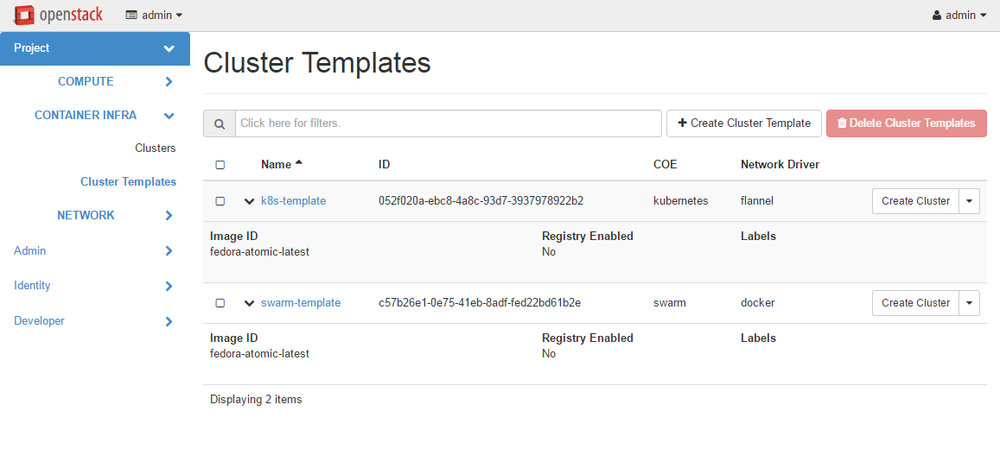
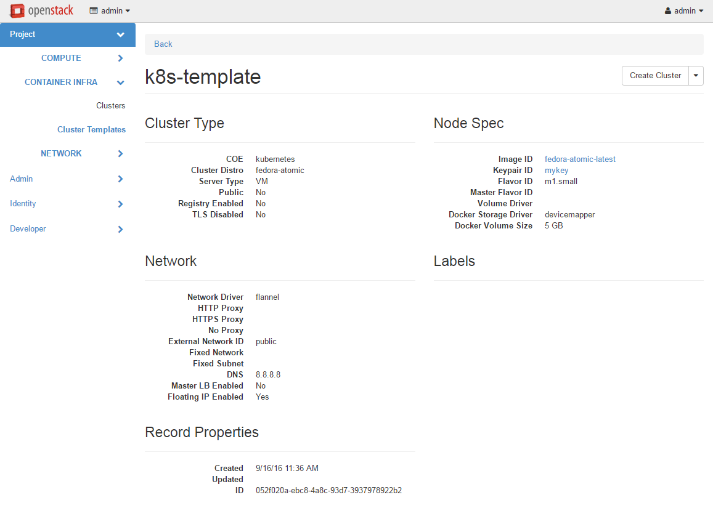
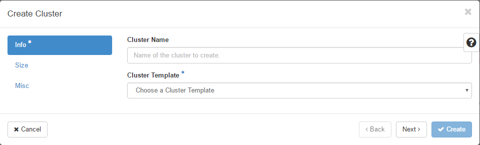

=================
Magnum User Guide
=================

This guide is intended for users who use Magnum to deploy and manage clusters
of hosts for a Container Orchestration Engine.  It describes the infrastructure
that Magnum creates and how to work with them.

Section 1-3 describe Magnum itself, including an overview, the CLI and
Horizon interface.  Section 4-9 describe the Container Orchestration
Engine (COE) supported along with a guide on how to select one that
best meets your needs and how to develop a driver for a new COE.
Section 10-15 describe the low level OpenStack infrastructure that is
created and managed by Magnum to support the COE's.

#. `Overview`_
#. `Python Client`_
#. `Horizon Interface`_
#. `Cluster Drivers`_
#. `Heat Stack Templates`_
#. `Choosing a COE`_
#. `Native Clients`_
#. `Kubernetes`_
#. `Transport Layer Security`_
#. `Networking`_
#. `High Availability`_
#. `Scaling`_
#. `Storage`_
#. `Image Management`_
#. `Notification`_
#. `Container Monitoring`_
#. `Kubernetes Post Install Manifest`_
#. `Kubernetes External Load Balancer`_
#. `Keystone Authentication and Authorization for Kubernetes`_
#. `Node Groups`_
#. `Kubernetes Health Monitoring`_

Overview
========

Magnum is an OpenStack API service developed by the OpenStack Containers Team
making container orchestration engines (COE) such as
Kubernetes available as first class resources in OpenStack.

Magnum uses Heat to orchestrate an OS image which contains Docker and COE
and runs that image in either virtual machines or bare metal in a cluster
configuration.

Magnum offers complete life-cycle management of COEs in an
OpenStack environment, integrated with other OpenStack services for a seamless
experience for OpenStack users who wish to run containers in an OpenStack
environment.

Following are few salient features of Magnum:

- Standard API based complete life-cycle management for Container Clusters
- Multi-tenancy for container clusters
- Choice of COE: Kubernetes
- Choice of container cluster deployment model: VM or Bare-metal
- Keystone-based multi-tenant security and auth management
- Neutron based multi-tenant network control and isolation
- Cinder based volume service for containers
- Integrated with OpenStack: SSO experience for cloud users
- Secure container cluster access (TLS enabled)

ClusterTemplate
---------------

A ClusterTemplate (previously known as BayModel) is a collection of parameters
to describe how a cluster can be constructed.  Some parameters are relevant to
the infrastructure of the cluster, while others are for the particular COE.  In
a typical workflow, a user would create a ClusterTemplate, then create one or
more clusters using the ClusterTemplate.  A cloud provider can also define a
number of ClusterTemplates and provide them to the users.  A ClusterTemplate
cannot be updated or deleted if a cluster using this ClusterTemplate still
exists.

The definition and usage of the parameters of a ClusterTemplate are as follows.
They are loosely grouped as: mandatory, infrastructure, COE specific.

\<name\>
  Name of the ClusterTemplate to create.  The name does not have to be
  unique.  If multiple ClusterTemplates have the same name, you will need to
  use the UUID to select the ClusterTemplate when creating a cluster or
  updating, deleting a ClusterTemplate.  If a name is not specified, a random
  name will be generated using a string and a number, for example
  "pi-13-model".

--coe \<coe\>
  Specify the Container Orchestration Engine to use.  Supported
  COE is 'kubernetes'.  If your environment
  has additional cluster drivers installed, refer to the cluster driver
  documentation for the new COE names.  This is a mandatory parameter
  and there is no default value.

--image \<image\>
  The name or UUID of the base image in Glance to boot the servers for
  the cluster.  The image must have the attribute 'os_distro' defined
  as appropriate for the cluster driver.  For the currently supported
  images, the os_distro names are:

  ========== =====================
  COE        os_distro
  ========== =====================
  Kubernetes fedora-coreos
  ========== =====================

  This is a mandatory parameter and there is no default value. Note that the
  os_distro attribute is case sensitive.

--keypair \<keypair\>
  The name of the SSH keypair to configure in the cluster servers
  for ssh access.  You will need the key to be able to ssh to the
  servers in the cluster.  The login name is specific to the cluster
  driver. If keypair is not provided in template it will be required at
  Cluster create. This value will be overridden by any keypair value that
  is provided during Cluster create.

--external-network \<external-network\>
  The name or network ID of a Neutron network to provide connectivity
  to the external internet for the cluster.  This network must be an
  external network, i.e. its attribute 'router:external' must be
  'True'.  The servers in the cluster will be connected to a private
  network and Magnum will create a router between this private network
  and the external network.  This will allow the servers to download
  images, access discovery service, etc, and the containers to install
  packages, etc.  In the opposite direction, floating IP's will be
  allocated from the external network to provide access from the
  external internet to servers and the container services hosted in
  the cluster.  This is a mandatory parameter and there is no default
  value.

--public
  Access to a ClusterTemplate is normally limited to the admin, owner or users
  within the same tenant as the owners.  Setting this flag
  makes the ClusterTemplate public and accessible by other users.  The default
  is not public.

--server-type \<server-type\>
  The servers in the cluster can be VM or baremetal.  This parameter selects
  the type of server to create for the cluster.  The default is 'vm'. Possible
  values are 'vm', 'bm'.

--network-driver \<network-driver\>
  The name of a network driver for providing the networks for the
  containers.  Note that this is different and separate from the Neutron
  network for the cluster.  The operation and networking model are specific
  to the particular driver; refer to the `Networking`_ section for more
  details.  Supported network drivers and the default driver are:

  ===========  =================  ========
  COE           Network-Driver    Default
  ===========  =================  ========
  Kubernetes   flannel, calico    flannel
  ===========  =================  ========

  Note that the network driver name is case sensitive.

--volume-driver \<volume-driver\>
  The name of a volume driver for managing the persistent storage for
  the containers.  The functionality supported are specific to the
  driver.  Supported volume drivers and the default driver are:

  ============= ============= ===========
  COE           Volume-Driver Default
  ============= ============= ===========
  Kubernetes    cinder        No Driver
  ============= ============= ===========

  Note that the volume driver name is case sensitive.

--dns-nameserver \<dns-nameserver\>
  The DNS nameserver for the servers and containers in the cluster to use.
  This is configured in the private Neutron network for the cluster.  The
  default is '8.8.8.8'.

--flavor \<flavor\>
  The nova flavor id for booting the node servers.  The default
  is 'm1.small'. This value can be overridden at cluster creation.

--master-flavor \<master-flavor\>
  The nova flavor id for booting the master or manager servers.  The
  default is 'm1.small'. This value can be overridden at cluster creation.

--http-proxy \<http-proxy\>
  The IP address for a proxy to use when direct http access from the
  servers to sites on the external internet is blocked.  This may
  happen in certain countries or enterprises, and the proxy allows the
  servers and containers to access these sites.  The format is a URL
  including a port number.  The default is 'None'.

--https-proxy \<https-proxy\>
  The IP address for a proxy to use when direct https access from the
  servers to sites on the external internet is blocked.  This may
  happen in certain countries or enterprises, and the proxy allows the
  servers and containers to access these sites.  The format is a URL
  including a port number.  The default is 'None'.

--no-proxy \<no-proxy\>
  When a proxy server is used, some sites should not go through the
  proxy and should be accessed normally.  In this case, you can
  specify these sites as a comma separated list of IP's.  The default
  is 'None'.

--docker-volume-size \<docker-volume-size\>
  If specified, container images will be stored in a cinder volume of the
  specified size in GB. Each cluster node will have a volume attached of
  the above size. If not specified, images will be stored in the compute
  instance's local disk. For the 'devicemapper' storage driver, must specify
  volume and the minimum value is 3GB. For the 'overlay' and 'overlay2'
  storage driver, the minimum value is 1GB or None(no volume).
  This value can be overridden at cluster creation.

--docker-storage-driver \<docker-storage-driver\>
  The name of a driver to manage the storage for the images and the
  container's writable layer. The default is 'devicemapper'.

--labels \<KEY1=VALUE1,KEY2=VALUE2;KEY3=VALUE3...\>
  Arbitrary labels in the form of key=value pairs.  The accepted keys
  and valid values are defined in the cluster drivers.  They are used as a
  way to pass additional parameters that are specific to a cluster driver.
  Refer to the subsection on labels for a list of the supported
  key/value pairs and their usage.
  The value can be overridden at cluster creation.

--tls-disabled
  Transport Layer Security (TLS) is normally enabled to secure the
  cluster.  In some cases, users may want to disable TLS in the cluster,
  for instance during development or to troubleshoot certain problems.
  Specifying this parameter will disable TLS so that users can access
  the COE endpoints without a certificate.  The default is TLS
  enabled.

--registry-enabled
  Docker images by default are pulled from the public Docker registry,
  but in some cases, users may want to use a private registry.  This
  option provides an alternative registry based on the Registry V2:
  Magnum will create a local registry in the cluster backed by swift to
  host the images.  Refer to
  `Docker Registry 2.0 <https://github.com/docker/distribution>`_
  for more details.  The default is to use the public registry.

--master-lb-enabled
  Since multiple masters may exist in a cluster, a load balancer is
  created to provide the API endpoint for the cluster and to direct
  requests to the masters.  In some cases, such as when the LBaaS
  service is not available, this option can be set to 'false' to
  create a cluster without the load balancer.  In this case, one of the
  masters will serve as the API endpoint.  The default is 'true',
  i.e. to create the load balancer for the cluster.

Labels
------

Labels is a general method to specify supplemental parameters that are
specific to certain COE or associated with certain options.  Their
format is key/value pair and their meaning is interpreted by the
drivers that uses them.  The drivers do validate the key/value pairs.
Their usage is explained in details in the appropriate sections,
however, since there are many possible labels, the following table
provides a summary to help give a clearer picture.  The label keys in
the table are linked to more details elsewhere in the user guide.

+---------------------------------------+--------------------+---------------+
| label key                             | label value        | default       |
+=======================================+====================+===============+
| `flannel_network_cidr`_               | IPv4 CIDR          | 10.100.0.0/16 |
|                                       |                    |               |
+---------------------------------------+--------------------+---------------+
| `flannel_backend`_                    | - udp              | vxlan         |
|                                       | - vxlan            |               |
|                                       | - host-gw          |               |
+---------------------------------------+--------------------+---------------+
| `flannel_network_subnetlen`_          | size of subnet to  | 24            |
|                                       | assign to node     |               |
+---------------------------------------+--------------------+---------------+
| `heapster_enabled`_                   | - true             | false         |
|                                       | - false            |               |
+---------------------------------------+--------------------+---------------+
| `metrics_server_chart_tag`            | see below          | see below     |
+---------------------------------------+--------------------+---------------+
| `metrics_server_enabled`              | - true             | true          |
|                                       | - false            |               |
+---------------------------------------+--------------------+---------------+
| `monitoring_enabled`                  | - true             | false         |
|                                       | - false            |               |
+---------------------------------------+--------------------+---------------+
| `monitoring_retention_days`           | see below          | see below     |
+---------------------------------------+--------------------+---------------+
| `monitoring_retention_size`           | see below          | see below     |
+---------------------------------------+--------------------+---------------+
| `monitoring_storage_class_name`       | see below          | see below     |
+---------------------------------------+--------------------+---------------+
| `monitoring_interval_seconds`         | see below          | see below     |
+---------------------------------------+--------------------+---------------+
| `monitoring_ingress_enabled`          | - true             | false         |
|                                       | - false            |               |
+---------------------------------------+--------------------+---------------+
| `cluster_basic_auth_secret`           | see below          | see below     |
+---------------------------------------+--------------------+---------------+
| `cluster_root_domain_name`            | see below          | see below     |
+---------------------------------------+--------------------+---------------+
| `prometheus_operator_chart_tag`       | see below          | see below     |
+---------------------------------------+--------------------+---------------+
| `prometheus_adapter_enabled`          | - true             | true          |
|                                       | - false            |               |
+---------------------------------------+--------------------+---------------+
| `prometheus_adapter_chart_tag`        | see below          | see below     |
+---------------------------------------+--------------------+---------------+
| `prometheus_adapter_configmap`        | (rules CM name)    | ""            |
+---------------------------------------+--------------------+---------------+
| `traefik_ingress_controller_tag`_     | see below          | see below     |
+---------------------------------------+--------------------+---------------+
| `admission_control_list`_             | see below          | see below     |
+---------------------------------------+--------------------+---------------+
| `prometheus_monitoring` (deprecated)  | - true             | false         |
|                                       | - false            |               |
+---------------------------------------+--------------------+---------------+
| `grafana_admin_passwd`                | (any string)       | "admin"       |
+---------------------------------------+--------------------+---------------+
| `hyperkube_prefix`_                   | see below          | see below     |
+---------------------------------------+--------------------+---------------+
| `kube_tag`_                           | see below          | see below     |
+---------------------------------------+--------------------+---------------+
| `cloud_provider_tag`_                 | see below          | see below     |
+---------------------------------------+--------------------+---------------+
| `etcd_tag`_                           | see below          | see below     |
+---------------------------------------+--------------------+---------------+
| `coredns_tag`_                        | see below          | see below     |
+---------------------------------------+--------------------+---------------+
| `flannel_tag`_                        | see below          | see below     |
+---------------------------------------+--------------------+---------------+
| `flannel_cni_tag`_                    | see below          | see below     |
+---------------------------------------+--------------------+---------------+
| `heat_container_agent_tag`_           | see below          | see below     |
+---------------------------------------+--------------------+---------------+
| `kube_dashboard_enabled`_             | - true             | true          |
|                                       | - false            |               |
+---------------------------------------+--------------------+---------------+
| `kube_dashboard_version`_             | see below          | see below     |
+---------------------------------------+--------------------+---------------+
| `metrics_scraper_tag`_                | see below          | see below     |
+---------------------------------------+--------------------+---------------+
| `influx_grafana_dashboard_enabled`_   | - true             | false         |
|                                       | - false            |               |
+---------------------------------------+--------------------+---------------+
| `docker_volume_type`_                 | see below          | see below     |
+---------------------------------------+--------------------+---------------+
| `boot_volume_size`_                   | see below          | see below     |
+---------------------------------------+--------------------+---------------+
| `boot_volume_type`_                   | see below          | see below     |
+---------------------------------------+--------------------+---------------+
| `etcd_volume_size`_                   | etcd storage       | 0             |
|                                       | volume size        |               |
+---------------------------------------+--------------------+---------------+
| `etcd_volume_type`_                   | see below          | see below     |
+---------------------------------------+--------------------+---------------+
| `container_infra_prefix`_             | see below          | ""            |
+---------------------------------------+--------------------+---------------+
| `availability_zone`_                  | AZ for the cluster | ""            |
|                                       | nodes              |               |
+---------------------------------------+--------------------+---------------+
| `cert_manager_api`_                   | see below          | false         |
+---------------------------------------+--------------------+---------------+
| `ingress_controller`_                 | see below          | ""            |
+---------------------------------------+--------------------+---------------+
| `ingress_controller_role`_            | see below          | "ingress"     |
+---------------------------------------+--------------------+---------------+
| `octavia_ingress_controller_tag`_     | see below          | see below     |
+---------------------------------------+--------------------+---------------+
| `nginx_ingress_controller_tag`_       | see below          | see below     |
+---------------------------------------+--------------------+---------------+
| `nginx_ingress_controller_chart_tag`_ | see below          | see below     |
+---------------------------------------+--------------------+---------------+
| `kubelet_options`_                    | extra kubelet args | ""            |
+---------------------------------------+--------------------+---------------+
| `kubeapi_options`_                    | extra kubeapi args | ""            |
+---------------------------------------+--------------------+---------------+
| `kubescheduler_options`_              | extra kubescheduler| ""            |
|                                       | args               |               |
+---------------------------------------+--------------------+---------------+
| `kubecontroller_options`_             | extra              | ""            |
|                                       | kubecontroller args|               |
+---------------------------------------+--------------------+---------------+
| `kubeproxy_options`_                  | extra kubeproxy    | ""            |
|                                       | args               |               |
+---------------------------------------+--------------------+---------------+
| `cgroup_driver`_                      | - systemd          | "cgroupfs"    |
|                                       | - cgroupfs         |               |
+---------------------------------------+--------------------+---------------+
| `cloud_provider_enabled`_             | - true             | see below     |
|                                       | - false            |               |
+---------------------------------------+--------------------+---------------+
| `service_cluster_ip_range`            | IPv4 CIDR for k8s  | 10.254.0.0/16 |
|                                       | service portals    |               |
+---------------------------------------+--------------------+---------------+
| `keystone_auth_enabled`_              | see below          | true          |
+---------------------------------------+--------------------+---------------+
| `k8s_keystone_auth_tag`_              | see below          | see below     |
+---------------------------------------+--------------------+---------------+
| `helm_client_url`_                    | see below          | see below     |
+---------------------------------------+--------------------+---------------+
| `helm_client_sha256`_                 | see below          | see below     |
+---------------------------------------+--------------------+---------------+
| `helm_client_tag`_                    | see below          | see below     |
+---------------------------------------+--------------------+---------------+
| `master_lb_floating_ip_enabled`_      | - true             | see below     |
|                                       | - false            |               |
+---------------------------------------+--------------------+---------------+
| `master_lb_allowed_cidrs`_            | see below          | ""            |
+---------------------------------------+--------------------+---------------+
| `auto_healing_enabled`_               | - true             | false         |
|                                       | - false            |               |
+---------------------------------------+--------------------+---------------+
| `auto_healing_controller`_            | see below          | "draino"      |
+---------------------------------------+--------------------+---------------+
| `magnum_auto_healer_tag`_             | see below          | see below     |
+---------------------------------------+--------------------+---------------+
| `auto_scaling_enabled`_               | - true             | false         |
|                                       | - false            |               |
+---------------------------------------+--------------------+---------------+
| `node_problem_detector_tag`_          | see below          | see below     |
+---------------------------------------+--------------------+---------------+
| `draino_tag`_                         | see below          | see below     |
+---------------------------------------+--------------------+---------------+
| `autoscaler_tag`_                     | see below          | see below     |
+---------------------------------------+--------------------+---------------+
| `min_node_count`_                     | see below          | see below     |
+---------------------------------------+--------------------+---------------+
| `max_node_count`_                     | see below          | see below     |
+---------------------------------------+--------------------+---------------+
| `npd_enabled`_                        | - true             | true          |
|                                       | - false            |               |
+---------------------------------------+--------------------+---------------+
| `use_podman`_                         | - true             | see below     |
|                                       | - false            |               |
+---------------------------------------+--------------------+---------------+
| `selinux_mode`_                       | - enforcing        | see below     |
|                                       | - permissive       |               |
|                                       | - disabled         |               |
+---------------------------------------+--------------------+---------------+
| `container_runtime`_                  | - ""               | ""            |
|                                       | - containerd       |               |
+---------------------------------------+--------------------+---------------+
| `containerd_version`_                 | see below          | see below     |
+---------------------------------------+--------------------+---------------+
| `containerd_tarball_url`_             | see below          | see below     |
+---------------------------------------+--------------------+---------------+
| `containerd_tarball_sha256`_          | see below          | see below     |
+---------------------------------------+--------------------+---------------+
| `calico_tag`_                         | see below          | see below     |
+---------------------------------------+--------------------+---------------+
| `calico_ipv4pool`_                    | see below          | 10.100.0.0/16 |
+---------------------------------------+--------------------+---------------+
| `calico_ipv4pool_ipip`_               | see below          | Off           |
+---------------------------------------+--------------------+---------------+
| `fixed_subnet_cidr`_                  | see below          | ""            |
+---------------------------------------+--------------------+---------------+
| `octavia_provider`_                   | see below          | amphora       |
+---------------------------------------+--------------------+---------------+
| `octavia_lb_algorithm`_               | see bellow         | ROUND_ROBIN   |
+---------------------------------------+--------------------+---------------+
| `octavia_lb_healthcheck`_             | see bellow         | true          |
+---------------------------------------+--------------------+---------------+

.. _cluster:

Cluster
-------

A cluster is an instance of the ClusterTemplate
of a COE.  Magnum deploys a cluster by referring to the attributes
defined in the particular ClusterTemplate as well as a few additional
parameters for the cluster.  Magnum deploys the orchestration templates
provided by the cluster driver to create and configure all the necessary
infrastructure.  When ready, the cluster is a fully operational COE that
can host containers.

Infrastructure
--------------

The infrastructure of the cluster consists of the resources provided by
the various OpenStack services.  Existing infrastructure, including
infrastructure external to OpenStack, can also be used by the cluster,
such as DNS, public network, public discovery service, Docker registry.
The actual resources created depends on the COE type and the options
specified; therefore you need to refer to the cluster driver documentation
of the COE for specific details.  For instance, the option
'--master-lb-enabled' in the ClusterTemplate will cause a load balancer pool
along with the health monitor and floating IP to be created.  It is
important to distinguish resources in the IaaS level from resources in
the PaaS level.  For instance, the infrastructure networking in
OpenStack IaaS is different and separate from the container networking
in Kubernetes PaaS.

Typical infrastructure includes the following.

Servers
  The servers host the containers in the cluster and these servers can be
  VM or bare metal.  VM's are provided by Nova.  Since multiple VM's
  are hosted on a physical server, the VM's provide the isolation
  needed for containers between different tenants running on the same
  physical server.  Bare metal servers are provided by Ironic and are
  used when peak performance with virtually no overhead is needed for
  the containers.

Identity
  Keystone provides the authentication and authorization for managing
  the cluster infrastructure.

Network
  Networking among the servers is provided by Neutron.  Since COE
  currently are not multi-tenant, isolation for multi-tenancy on the
  networking level is done by using a private network for each cluster.
  As a result, containers belonging to one tenant will not be
  accessible to containers or servers of another tenant.  Other
  networking resources may also be used, such as load balancer and
  routers.  Networking among containers can be provided by Kuryr if
  needed.

Storage
  Cinder provides the block storage that can be used to host the
  containers and as persistent storage for the containers.

Security
  Barbican provides the storage of secrets such as certificates used
  for Transport Layer Security (TLS) within the cluster.

Life cycle
----------

The set of life cycle operations on the cluster is one of the key value
that Magnum provides, enabling clusters to be managed painlessly on
OpenStack.  The current operations are the basic CRUD operations, but
more advanced operations are under discussion in the community and
will be implemented as needed.

**NOTE** The OpenStack resources created for a cluster are fully
accessible to the cluster owner.  Care should be taken when modifying or
reusing these resources to avoid impacting Magnum operations in
unexpected manners.  For instance, if you launch your own Nova
instance on the cluster private network, Magnum would not be aware of this
instance.  Therefore, the cluster-delete operation will fail because
Magnum would not delete the extra Nova instance and the private Neutron
network cannot be removed while a Nova instance is still attached.

**NOTE** Currently Heat nested templates are used to create the
resources; therefore if an error occurs, you can troubleshoot through
Heat.  For more help on Heat stack troubleshooting, refer to the
:ref:`magnum_troubleshooting_guide`.

Create
++++++

The 'cluster-create' command deploys a cluster, for example::

    openstack coe cluster create mycluster \
                      --cluster-template mytemplate \
                      --node-count 8 \
                      --master-count 3

The 'cluster-create' operation is asynchronous; therefore you can initiate
another 'cluster-create' operation while the current cluster is being created.
If the cluster fails to be created, the infrastructure created so far may
be retained or deleted depending on the particular orchestration
engine.  As a common practice, a failed cluster is retained during
development for troubleshooting, but they are automatically deleted in
production.  The current cluster drivers use Heat templates and the
resources of a failed 'cluster-create' are retained.

The definition and usage of the parameters for 'cluster-create' are as
follows:

\<name\>
  Name of the cluster to create.  If a name is not specified, a random
  name will be generated using a string and a number, for example
  "gamma-7-cluster".

--cluster-template \<cluster-template\>
  The ID or name of the ClusterTemplate to use.  This is a mandatory
  parameter.  Once a ClusterTemplate is used to create a cluster, it cannot
  be deleted or modified until all clusters that use the ClusterTemplate have
  been deleted.

--keypair \<keypair\>
  The name of the SSH keypair to configure in the cluster servers
  for ssh access.  You will need the key to be able to ssh to the
  servers in the cluster.  The login name is specific to the cluster
  driver. If keypair is not provided it will attempt to use the value in
  the ClusterTemplate. If the ClusterTemplate is also missing a keypair value
  then an error will be returned.  The keypair value provided here will
  override the keypair value from the ClusterTemplate.

--node-count \<node-count\>
  The number of servers that will serve as node in the cluster.
  The default is 1.

--master-count \<master-count\>
  The number of servers that will serve as master for the cluster.
  The default is 1.  Set to more than 1 master to enable High
  Availability.  If the option '--master-lb-enabled' is specified in
  the ClusterTemplate, the master servers will be placed in a load balancer
  pool.

--discovery-url \<discovery-url\>
  The custom discovery url for node discovery.  This is used by the
  COE to discover the servers that have been created to host the
  containers.  The actual discovery mechanism varies with the COE.  In
  some cases, Magnum fills in the server info in the discovery
  service.  In other cases, if the discovery-url is not specified,
  Magnum will use the public discovery service at::

    https://discovery.etcd.io

  In this case, Magnum will generate a unique url here for each cluster
  and store the info for the servers.

--timeout \<timeout\>
  The timeout for cluster creation in minutes. The value expected is a
  positive integer and the default is 60 minutes.  If the timeout is
  reached during cluster-create, the operation will be aborted and the
  cluster status will be set to 'CREATE_FAILED'.

--master-lb-enabled
  Indicates whether created clusters should have a load balancer for
  master nodes or not.

List
++++

The 'cluster-list' command lists all the clusters that belong to the tenant,
for example::

    openstack coe cluster list

Show
++++

The 'cluster-show' command prints all the details of a cluster, for
example::

    openstack coe cluster show mycluster

The properties include those not specified by users that have been
assigned default values and properties from new resources that
have been created for the cluster.

Update
++++++

A cluster can be modified using the 'cluster-update' command, for example::

    openstack coe cluster update mycluster replace node_count=8

The parameters are positional and their definition and usage are as
follows.

\<cluster\>
  This is the first parameter, specifying the UUID or name of the cluster
  to update.

\<op\>
  This is the second parameter, specifying the desired change to be
  made to the cluster attributes.  The allowed changes are 'add',
  'replace' and 'remove'.

\<attribute=value\>
  This is the third parameter, specifying the targeted attributes in
  the cluster as a list separated by blank space.  To add or replace an
  attribute, you need to specify the value for the attribute.  To
  remove an attribute, you only need to specify the name of the
  attribute.  Currently the only attribute that can be replaced or
  removed is 'node_count'.  The attributes 'name', 'master_count' and
  'discovery_url' cannot be replaced or delete.  The table below
  summarizes the possible change to a cluster.

  +---------------+-----+-------------------+-----------------------+
  | Attribute     | add | replace           | remove                |
  +===============+=====+===================+=======================+
  | node_count    | no  | add/remove nodes  | reset to default of 1 |
  |               |     | in default-worker |                       |
  |               |     | nodegroup.        |                       |
  +---------------+-----+-------------------+-----------------------+
  | master_count  | no  | no                |  no                   |
  +---------------+-----+-------------------+-----------------------+
  | name          | no  | no                |  no                   |
  +---------------+-----+-------------------+-----------------------+
  | discovery_url | no  | no                |  no                   |
  +---------------+-----+-------------------+-----------------------+

The 'cluster-update' operation cannot be initiated when another operation
is in progress.

**NOTE:** The attribute names in cluster-update are slightly different
from the corresponding names in the cluster-create command: the dash '-'
is replaced by an underscore '_'.  For instance, 'node-count' in
cluster-create is 'node_count' in cluster-update.

Scale
+++++

Scaling a cluster means adding servers to or removing servers from the cluster.
Currently, this is done through the 'cluster-update' operation by modifying
the node-count attribute, for example::

    openstack coe cluster update mycluster replace node_count=2

When some nodes are removed, Magnum will attempt to find nodes with no
containers to remove.  If some nodes with containers must be removed,
Magnum will log a warning message.

Delete
++++++

The 'cluster-delete' operation removes the cluster by deleting all resources
such as servers, network, storage;  for example::

    openstack coe cluster delete mycluster

The only parameter for the cluster-delete command is the ID or name of the
cluster to delete.  Multiple clusters can be specified, separated by a blank
space.

If the operation fails, there may be some remaining resources that
have not been deleted yet.  In this case, you can troubleshoot through
Heat.  If the templates are deleted manually in Heat, you can delete
the cluster in Magnum to clean up the cluster from Magnum database.

The 'cluster-delete' operation can be initiated when another operation is
still in progress.

Python Client
=============

Installation
------------

Follow the instructions in the OpenStack Installation Guide to enable the
repositories for your distribution:

* `RHEL/CentOS/Fedora
  <https://docs.openstack.org/liberty/install-guide-rdo/>`_
* `Ubuntu/Debian
  <https://docs.openstack.org/liberty/install-guide-ubuntu/>`_
* `openSUSE/SUSE Linux Enterprise
  <https://docs.openstack.org/liberty/install-guide-obs/>`_

Install using distribution packages for RHEL/CentOS/Fedora::

    $ sudo yum install python-magnumclient

Install using distribution packages for Ubuntu/Debian::

    $ sudo apt-get install python-magnumclient

Install using distribution packages for openSUSE and SUSE Enterprise Linux::

    $ sudo zypper install python3-magnumclient

Verifying installation
----------------------

Execute the `openstack coe cluster list` command to confirm that the client is
installed and in the system path::

    $ openstack coe cluster list

Using the command-line client
-----------------------------

Refer to the `OpenStack Command-Line Interface Reference
<https://docs.openstack.org/cli-reference/magnum.html>`_ for a full list of the
commands supported by the `openstack coe` command-line client.

Horizon Interface
=================

Magnum provides a Horizon plugin so that users can access the Container
Infrastructure Management service through the OpenStack browser-based
graphical UI.  The plugin is available from
`magnum-ui <https://opendev.org/openstack/magnum-ui>`_.  It is not
installed by default in the standard Horizon service, but you can
follow the instruction for `installing a Horizon plugin
<https://docs.openstack.org/horizon/latest/contributor/tutorials/plugin.html#installing-your-plugin>`_.

In Horizon, the container infrastructure panel is part of the
'Project' view and it currently supports the following operations:

- View list of cluster templates
- View details of a cluster template
- Create a cluster template
- Delete a cluster template
- View list of clusters
- View details of a cluster
- Create a cluster
- Delete a cluster
- Get the Certificate Authority for a cluster
- Sign a user key and obtain a signed certificate for accessing the secured
  COE API endpoint in a cluster.

Other operations are not yet supported and the CLI should be used for these.

Following is the screenshot of the Horizon view showing the list of cluster
templates.

Following is the screenshot of the Horizon view showing the details of a
cluster template.

Following is the screenshot of the dialog to create a new cluster.

Cluster Drivers
===============

A cluster driver is a collection of python code, heat templates, scripts,
images, and documents for a particular COE on a particular
distro.  Magnum presents the concept of ClusterTemplates and clusters.  The
implementation for a particular cluster type is provided by the cluster driver.
In other words, the cluster driver provisions and manages the infrastructure
for the COE.  Magnum includes default drivers for the following
COE and distro pairs:

+------------+---------------+
| COE        |  distro       |
+============+===============+
| Kubernetes | Fedora CoreOS |
+------------+---------------+

Magnum is designed to accommodate new cluster drivers to support custom
COE's and this section describes how a new cluster driver can be
constructed and enabled in Magnum.

Directory structure
-------------------

Magnum expects the components to be organized in the following
directory structure under the directory 'drivers'::

  COE_Distro/
     image/
     templates/
     api.py
     driver.py
     monitor.py
     scale.py
     template_def.py
     version.py

The minimum required components are:

driver.py
  Python code that implements the controller operations for
  the particular COE.  The driver must implement:
  Currently supported:
  ``cluster_create``, ``cluster_update``, ``cluster_delete``.

templates
  A directory of orchestration templates for managing the lifecycle
  of clusters, including creation, configuration, update, and deletion.
  Currently only Heat templates are supported, but in the future
  other orchestration mechanism such as Ansible may be supported.

template_def.py
  Python code that maps the parameters from the ClusterTemplate to the
  input parameters for the orchestration and invokes
  the orchestration in the templates directory.

version.py
  Tracks the latest version of the driver in this directory.
  This is defined by a ``version`` attribute and is represented in the
  form of ``1.0.0``. It should also include a ``Driver`` attribute with
  descriptive name such as ``k8s_fedora_coreos``.

The remaining components are optional:

image
  Instructions for obtaining or building an image suitable for the COE.

api.py
  Python code to interface with the COE.

monitor.py
  Python code to monitor the resource utilization of the cluster.

scale.py
  Python code to scale the cluster by adding or removing nodes.

Sample cluster driver
---------------------

To help developers in creating new COE drivers, a minimal cluster driver
is provided as an example.  The 'docker' cluster driver will simply deploy
a single VM running Ubuntu with the latest Docker version installed.
It is not a true cluster, but the simplicity will help to illustrate
the key concepts.

*To be filled in*

Installing a cluster driver
---------------------------
*To be filled in*

Heat Stack Templates
====================

.. include:: heat-templates.rst

Choosing a COE
==============

Choosing which COE to use depends on what tools you want to use to manage your
containers once you start your app.

Kubernetes
offers an attractive YAML file description of a pod, which is a grouping of
containers that run together as part of a distributed application. This file
format allows you to model your application deployment using a declarative
style. It has support for auto scaling and fault recovery, as well as features
that allow for sophisticated software deployments, including canary deploys
and blue/green deploys. Kubernetes is very popular, especially for web
applications.

Finding the right COE for your workload is up to you, but Magnum offers you a
choice to select among the prevailing leading options. Once you decide, see
the next sections for examples of how to create a cluster with your desired
COE.

Native Clients
==============

Magnum preserves the native user experience with a COE and does not
provide a separate API or client.  This means you will need to use the
native client for the particular cluster type to interface with the
clusters.  In the typical case, there are two clients to consider:

COE level
  This is the orchestration or management level such as Kubernetes
  its frameworks.

Container level
  This is the low level container operation.  Currently it is
  Docker for all clusters.

The clients can be CLI and/or browser-based.  You will need to refer
to the documentation for the specific native client and appropriate
version for details, but following are some pointers for reference.

Kubernetes CLI is the tool 'kubectl', which can be simply copied from
a node in the cluster or downloaded from the Kubernetes release.  For
instance, if the cluster is running Kubernetes release 1.2.0, the
binary for 'kubectl' can be downloaded as and set up locally as
follows::

    curl -O https://storage.googleapis.com/kubernetes-release/release/v1.2.0/bin/linux/amd64/kubectl
    chmod +x kubectl
    sudo mv kubectl /usr/local/bin/kubectl

Kubernetes also provides a browser UI. If the cluster has the
Kubernetes Dashboard running; it can be accessed using::

    eval $(openstack coe cluster config <cluster-name>)
    kubectl proxy

    The browser can be accessed at http://localhost:8001/ui

Depending on the client requirement, you may need to use a version of
the client that matches the version in the cluster.  To determine the
version of the COE and container, use the command 'cluster-show' and
look for the attribute *coe_version* and *container_version*::

    openstack coe cluster show k8s-cluster
    +--------------------+------------------------------------------------------------+
    | Property           | Value                                                      |
    +--------------------+------------------------------------------------------------+
    | status             | CREATE_COMPLETE                                            |
    | uuid               | 04952c60-a338-437f-a7e7-d016d1d00e65                       |
    | stack_id           | b7bf72ce-b08e-4768-8201-e63a99346898                       |
    | status_reason      | Stack CREATE completed successfully                        |
    | created_at         | 2016-07-25T23:14:06+00:00                                  |
    | updated_at         | 2016-07-25T23:14:10+00:00                                  |
    | create_timeout     | 60                                                         |
    | coe_version        | v1.2.0                                                     |
    | api_address        | https://192.168.19.86:6443                                 |
    | cluster_template_id| da2825a0-6d09-4208-b39e-b2db666f1118                       |
    | master_addresses   | ['192.168.19.87']                                          |
    | node_count         | 1                                                          |
    | node_addresses     | ['192.168.19.88']                                          |
    | master_count       | 1                                                          |
    | container_version  | 1.9.1                                                      |
    | discovery_url      | https://discovery.etcd.io/3b7fb09733429d16679484673ba3bfd5 |
    | name               | k8s-cluster                                                |
    +--------------------+------------------------------------------------------------+

Kubernetes
==========
Kubernetes uses a range of terminology that we refer to in this guide. We
define these common terms in the :ref:`Glossary` for your reference.

When Magnum deploys a Kubernetes cluster, it uses parameters defined in the
ClusterTemplate and specified on the cluster-create command, for example::

    openstack coe cluster template create k8s-cluster-template \
                               --image fedora-coreos-latest \
                               --keypair testkey \
                               --external-network public \
                               --dns-nameserver 8.8.8.8 \
                               --flavor m1.small \
                               --docker-volume-size 5 \
                               --network-driver flannel \
                               --coe kubernetes

    openstack coe cluster create k8s-cluster \
                          --cluster-template k8s-cluster-template \
                          --master-count 3 \
                          --node-count 8

Refer to the `ClusterTemplate`_ and `Cluster`_ sections for the full list of
parameters. Following are further details relevant to a Kubernetes cluster:

Number of masters (master-count)
  Specified in the cluster-create command to indicate how many servers will
  run as master in the cluster.  Having more than one will provide high
  availability.  The masters will be in a load balancer pool and the
  virtual IP address (VIP) of the load balancer will serve as the
  Kubernetes API endpoint.  For external access, a floating IP
  associated with this VIP is available and this is the endpoint
  shown for Kubernetes in the 'cluster-show' command.

Number of nodes (node-count)
  Specified in the cluster-create command to indicate how many servers will
  run as node in the cluster to host the users' pods.  The nodes are registered
  in Kubernetes using the Nova instance name.

Network driver (network-driver)
  Specified in the ClusterTemplate to select the network driver.
  The supported and default network driver is 'flannel', an overlay
  network providing a flat network for all pods.  Refer to the
  `Networking`_ section for more details.

Volume driver (volume-driver)
  Specified in the ClusterTemplate to select the volume driver. The supported
  volume driver is 'cinder', allowing Cinder volumes to be mounted in
  containers for use as persistent storage.  Data written to these volumes
  will persist after the container exits and can be accessed again from other
  containers, while data written to the union file system hosting the container
  will be deleted.  Refer to the `Storage`_ section for more details.

Storage driver (docker-storage-driver)
  Specified in the ClusterTemplate to select the Docker storage driver. The
  default is 'devicemapper'. Refer to the `Storage`_ section for more
  details.

  **NOTE:** For Fedora CoreOS driver, devicemapper is not supported.

Image (image)
  Specified in the ClusterTemplate to indicate the image to boot the servers.
  The image binary is loaded in Glance with the attribute
  'os_distro = fedora-coreos'.
  Current supported images is Fedora CoreOS (download from `Fedora CoreOS
  <https://getfedora.org/en/coreos/download?tab=cloud_operators>`_ )

TLS (tls-disabled)
  Transport Layer Security is enabled by default, so you need a key and
  signed certificate to access the Kubernetes API and CLI.  Magnum
  handles its own key and certificate when interfacing with the
  Kubernetes cluster.  In development mode, TLS can be disabled.  Refer to
  the 'Transport Layer Security'_ section for more details.

What runs on the servers
  The servers for Kubernetes master host containers in the 'kube-system'
  name space to run the Kubernetes proxy, scheduler and controller manager.
  The masters will not host users' pods.  Kubernetes API server, docker
  daemon, etcd and flannel run as systemd services.  The servers for
  Kubernetes node also host a container in the 'kube-system' name space
  to run the Kubernetes proxy, while Kubernetes kubelet, docker daemon
  and flannel run as systemd services.

Log into the servers
  You can log into the master servers using the login 'fedora' and the
  keypair specified in the ClusterTemplate.

In addition to the common attributes in the ClusterTemplate, you can specify
the following attributes that are specific to Kubernetes by using the
labels attribute.

_`admission_control_list`
  This label corresponds to Kubernetes parameter for the API server '--admission-control'.
  For more details, refer to the `Admission Controllers
  <https://kubernetes.io/docs/reference/access-authn-authz/admission-controllers/>`_.
  The default value corresponds to the one recommended in this doc
  for our current Kubernetes version.

_`boot_volume_size`
  This label overrides the default_boot_volume_size of instances which is
  useful if your flavors are boot from volume only. The default value is 0,
  meaning that cluster instances will not boot from volume.

_`boot_volume_type`
  This label overrides the default_boot_volume_type of instances which is
  useful if your flavors are boot from volume only. The default value is '',
  meaning that Magnum will randomly select a Cinder volume type from all
  available options.

_`etcd_volume_size`
  This label sets the size of a volume holding the etcd storage data.
  The default value is 0, meaning the etcd data is not persisted (no volume).

_`etcd_volume_type`
  This label overrides the default_etcd_volume_type holding the etcd storage
  data. The default value is '', meaning that Magnum will randomly select a
  Cinder volume type from all available options.

_`container_infra_prefix`
  Prefix of all container images used in the cluster (kubernetes components,
  coredns, kubernetes-dashboard, node-exporter). For example,
  kubernetes-apiserver is pulled from
  docker.io/openstackmagnum/kubernetes-apiserver, with this label it can be
  changed to myregistry.example.com/mycloud/kubernetes-apiserver. Similarly,
  all other components used in the cluster will be prefixed with this label,
  which assumes an operator has cloned all expected images in
  myregistry.example.com/mycloud.

  Images that must be mirrored:

  * docker.io/coredns/coredns:1.3.1
  * quay.io/coreos/etcd:v3.4.6
  * docker.io/k8scloudprovider/k8s-keystone-auth:v1.18.0
  * docker.io/k8scloudprovider/openstack-cloud-controller-manager:v1.18.0
  * gcr.io/google_containers/pause:3.1

  Images that might be needed when 'use_podman' is 'false':

  * docker.io/openstackmagnum/kubernetes-apiserver
  * docker.io/openstackmagnum/kubernetes-controller-manager
  * docker.io/openstackmagnum/kubernetes-kubelet
  * docker.io/openstackmagnum/kubernetes-proxy
  * docker.io/openstackmagnum/kubernetes-scheduler

  Images that might be needed:

  * k8s.gcr.io/hyperkube:v1.18.2
  * docker.io/grafana/grafana:5.1.5
  * docker.io/prom/node-exporter:latest
  * docker.io/prom/prometheus:latest
  * docker.io/traefik:v1.7.28
  * gcr.io/google_containers/kubernetes-dashboard-amd64:v1.5.1
  * gcr.io/google_containers/metrics-server-amd64:v0.3.6
  * k8s.gcr.io/node-problem-detector:v0.6.2
  * docker.io/planetlabs/draino:abf028a
  * docker.io/openstackmagnum/cluster-autoscaler:v1.18.1
  * quay.io/calico/cni:v3.13.1
  * quay.io/calico/pod2daemon-flexvol:v3.13.1
  * quay.io/calico/kube-controllers:v3.13.1
  * quay.io/calico/node:v3.13.1
  * quay.io/coreos/flannel-cni:v0.3.0
  * quay.io/coreos/flannel:v0.12.0-amd64

  Images that might be needed if 'monitoring_enabled' is 'true':

  * quay.io/prometheus/alertmanager:v0.20.0
  * docker.io/squareup/ghostunnel:v1.5.2
  * docker.io/jettech/kube-webhook-certgen:v1.0.0
  * quay.io/coreos/prometheus-operator:v0.37.0
  * quay.io/coreos/configmap-reload:v0.0.1
  * quay.io/coreos/prometheus-config-reloader:v0.37.0
  * quay.io/prometheus/prometheus:v2.15.2

  Images that might be needed if 'cinder_csi_enabled' is 'true':

  * docker.io/k8scloudprovider/cinder-csi-plugin:v1.18.0
  * quay.io/k8scsi/csi-attacher:v2.0.0
  * quay.io/k8scsi/csi-provisioner:v1.4.0
  * quay.io/k8scsi/csi-snapshotter:v1.2.2
  * quay.io/k8scsi/csi-resizer:v0.3.0
  * quay.io/k8scsi/csi-node-driver-registrar:v1.1.0

_`hyperkube_prefix`
  This label allows users to specify a custom prefix for Hyperkube container
  source since official Hyperkube images have been discontinued for `kube_tag`
  greater than 1.18.x. If you wish you use 1.19.x onwards, you may want to use
  unofficial sources like `docker.io/rancher/`, `ghcr.io/openstackmagnum/` or
  your own container registry. If `container_infra_prefix` label is defined, it
  still takes precedence over this label.
  Default: docker.io/rancher/

_`kube_tag`
  This label allows users to select a specific Kubernetes release based on its
  container tag for `Fedora CoreOS image
  <https://github.com/kubernetes/kubernetes/releases>`_. If unset, the current
  Magnum version's default Kubernetes release is installed.
  Stein default: v1.11.6
  Train default: v1.15.7
  Ussuri default: v1.18.2
  Victoria default: v1.18.16
  Yoga default: v1.23.3-rancher1

_`heapster_enabled`
  heapster_enabled is used to enable disable the installation of heapster.
  Ussuri default: false
  Train default: true

_`cloud_provider_tag`
  This label allows users to override the default
  openstack-cloud-controller-manager container image tag. Refer to
  `openstack-cloud-controller-manager page for available tags
  <https://hub.docker.com/r/k8scloudprovider/openstack-cloud-controller-manager/tags>`_.
  Stein default: v0.2.0
  Train default: v1.15.0
  Ussuri default: v1.18.0

_`etcd_tag`
  This label allows users to select `a specific etcd version,
  based on its container tag
  <https://quay.io/repository/coreos/etcd?tab=tags>`_.
  If unset, the current Magnum version's a default etcd version.
  Stein default: v3.2.7
  Train default: 3.2.26
  Ussuri default: v3.4.6

_`coredns_tag`
  This label allows users to select `a specific coredns version,
  based on its container tag
  <https://hub.docker.com/r/coredns/coredns/tags/>`_.
  If unset, the current Magnum version's a default etcd version.
  Stein default: 1.3.1
  Train default: 1.3.1
  Ussuri default: 1.6.6

_`flannel_tag`
  This label allows users to select a specific flannel version,
  based on its container tag:

  * `<=v0.15.1 <https://quay.io/repository/coreos/flannel?tab=tags>`_
  * `>=v0.20.2 <https://hub.docker.com/r/flannel/flannel/tags>`_

  If unset, the default version will be used.

_`flannel_cni_tag`
  This label allows users to select `a specific flannel_cni version,
  based on its container tag. This container adds the cni plugins in
  the host under /opt/cni/bin
  <https://quay.io/repository/coreos/flannel-cni?tab=tags>`_.
  If unset, the current Magnum version's a default flannel version.
  Stein default: v0.3.0
  Train default: v0.3.0
  Ussuri default: v0.3.0

_`heat_container_agent_tag`
  This label allows users to select `a specific heat_container_agent
  version, based on its container tag
  <https://hub.docker.com/r/openstackmagnum/heat-container-agent/tags/>`_.
  Train-default: train-stable-3
  Ussuri-default: ussuri-stable-1
  Victoria-default: victoria-stable-1
  Wallaby-default: wallaby-stable-1

_`kube_dashboard_enabled`
  This label triggers the deployment of the kubernetes dashboard.
  The default value is 1, meaning it will be enabled.

_`cert_manager_api`
  This label enables the kubernetes `certificate manager api
  <https://kubernetes.io/docs/tasks/tls/managing-tls-in-a-cluster/>`_.

_`kubelet_options`
  This label can hold any additional options to be passed to the kubelet.
  For more details, refer to the `kubelet admin guide
  <https://kubernetes.io/docs/reference/command-line-tools-reference/kubelet/>`_.
  By default no additional options are passed.

_`kubeproxy_options`
  This label can hold any additional options to be passed to the kube proxy.
  For more details, refer to the `kube proxy admin guide
  <https://kubernetes.io/docs/reference/command-line-tools-reference/kube-proxy/>`_.
  By default no additional options are passed.

_`kubecontroller_options`
  This label can hold any additional options to be passed to the kube controller manager.
  For more details, refer to the `kube controller manager admin guide
  <https://kubernetes.io/docs/reference/command-line-tools-reference/kube-controller-manager/>`_.
  By default no additional options are passed.

_`kubeapi_options`
  This label can hold any additional options to be passed to the kube api server.
  For more details, refer to the `kube api admin guide
  <https://kubernetes.io/docs/reference/command-line-tools-reference/kube-apiserver/>`_.
  By default no additional options are passed.

_`kubescheduler_options`
  This label can hold any additional options to be passed to the kube scheduler.
  For more details, refer to the `kube scheduler admin guide
  <https://kubernetes.io/docs/reference/command-line-tools-reference/kube-scheduler/>`_.
  By default no additional options are passed.

_`influx_grafana_dashboard_enabled`
  The kubernetes dashboard comes with heapster enabled. If this
  label is set, an influxdb and grafana instance will be deployed,
  heapster will push data to influx and grafana will project them.

_`cgroup_driver`
  This label tells kubelet which Cgroup driver to use. Ideally this
  should be identical to the Cgroup driver that Docker has been
  started with.

_`cloud_provider_enabled`
  Add 'cloud_provider_enabled' label for the k8s_fedora_atomic driver. Defaults
  to the value of 'cluster_user_trust' (default: 'false' unless explicitly set
  to 'true' in magnum.conf due to CVE-2016-7404). Consequently,
  'cloud_provider_enabled' label cannot be overridden to 'true' when
  'cluster_user_trust' resolves to 'false'. For specific kubernetes versions,
  if 'cinder' is selected as a 'volume_driver', it is implied that the cloud
  provider will be enabled since they are combined.

_`cinder_csi_enabled`
  When 'true', out-of-tree Cinder CSI driver will be enabled. Requires 'cinder'
  to be selected as a 'volume_driver' and consequently also requires label
  'cloud_provider_enabled' to be 'true' (see 'cloud_provider_enabled' section).
  Ussuri default: false
  Victoria default: true

_`cinder_csi_plugin_tag`
  This label allows users to override the default cinder-csi-plugin container
  image tag. Refer to `cinder-csi-plugin page for available tags
  <https://hub.docker.com/r/k8scloudprovider/cinder-csi-plugin/tags>`_.
  Train default: v1.16.0
  Ussuri default: v1.18.0
  Yoga default: v1.23.0

_`csi_attacher_tag`
  This label allows users to override the default container tag for CSI attacher.
  For additional tags, `refer to CSI attacher page
  <https://quay.io/repository/k8scsi/csi-attacher?tab=tags>`_.
  Ussuri-default: v2.0.0
  Yoga-default: v3.3.0

_`csi_provisioner_tag`
  This label allows users to override the default container tag for CSI provisioner.
  For additional tags, `refer to CSI provisioner page
  <https://quay.io/repository/k8scsi/csi-provisioner?tab=tags>`_.
  Ussuri-default: v1.4.0
  Yoga-default: v3.0.0

_`csi_snapshotter_tag`
  This label allows users to override the default container tag for CSI snapshotter.
  For additional tags, `refer to CSI snapshotter page
  <https://quay.io/repository/k8scsi/csi-snapshotter?tab=tags>`_.
  Ussuri-default: v1.2.2
  Yoga-default: v4.2.1

_`csi_resizer_tag`
  This label allows users to override the default container tag for CSI resizer.
  For additional tags, `refer to CSI resizer page
  <https://quay.io/repository/k8scsi/csi-resizer?tab=tags>`_.
  Ussuri-default: v0.3.0
  Yoga-default: v1.3.0

_`csi_node_driver_registrar_tag`
  This label allows users to override the default container tag for CSI node
  driver registrar. For additional tags, `refer to CSI node driver registrar
  page
  <https://quay.io/repository/k8scsi/csi-node-driver-registrar?tab=tags>`_.
  Ussuri-default: v1.1.0
  Yoga-default: v2.4.0

-`csi_liveness_probe_tag`
  This label allows users to override the default container tag for CSI
  liveness probe.
  Yoga-default: v2.5.0

_`keystone_auth_enabled`
  If this label is set to True, Kubernetes will support use Keystone for
  authorization and authentication.

_`k8s_keystone_auth_tag`
  This label allows users to override the default k8s-keystone-auth container
  image tag. Refer to `k8s-keystone-auth page for available tags
  <https://hub.docker.com/r/k8scloudprovider/k8s-keystone-auth/tags>`_.
  Stein default: v1.13.0
  Train default: v1.14.0
  Ussuri default: v1.18.0

_`helm_client_url`
  URL of the helm client binary.
  Default: ''

_`helm_client_sha256`
  SHA256 checksum of the helm client binary.
  Ussuri default: 018f9908cb950701a5d59e757653a790c66d8eda288625dbb185354ca6f41f6b

_`helm_client_tag`
  This label allows users to override the default container tag for Helm
  client.  For additional tags, `refer to Helm client page
  <https://github.com/helm/helm/tags>`_.
  Ussuri default: v3.2.1

_`master_lb_floating_ip_enabled`
  Controls if Magnum allocates floating IP for the load balancer of master
  nodes. This label only takes effect when the template property
  ``master_lb_enabled`` is set. If not specified, the default value is the same
  as template property ``floating_ip_enabled``.

_`master_lb_allowed_cidrs`
  A CIDR list which can be used to control the access for the load balancer of
  master nodes. The input format is comma delimited list. For example,
  192.168.0.0/16,10.0.0.0/24.
  Default: "" (which opens to 0.0.0.0/0)

_`auto_healing_enabled`
  If set to true, auto healing feature will be enabled. Defaults to false.

_`auto_healing_controller`
  This label sets the auto-healing service to be used. Currently ``draino`` and
  ``magnum-auto-healer`` are supported. The default is ``draino``. For more
  details, see
  `draino doc <https://github.com/planetlabs/draino>`_ and
  `magnum-auto-healer doc
  <https://github.com/kubernetes/cloud-provider-openstack/blob/master/docs/using-magnum-auto-healer.md>`_.

_`draino_tag`
  This label allows users to select a specific Draino version.

_`magnum_auto_healer_tag`
  This label allows users to override the default magnum-auto-healer container
  image tag. Refer to `magnum-auto-healer page for available tags
  <https://hub.docker.com/r/k8scloudprovider/magnum-auto-healer/tags>`_.
  Stein default: v1.15.0
  Train default: v1.15.0
  Ussuri default: v1.18.0

_`auto_scaling_enabled`
  If set to true, auto scaling feature will be enabled.
  Default: false.

_`autoscaler_tag`
  This label allows users to override the default cluster-autoscaler container
  image tag. Refer to `cluster-autoscaler page for available tags
  <https://hub.docker.com/r/openstackmagnum/cluster-autoscaler/tags>`_.
  Stein default: v1.0
  Train default: v1.0
  Ussuri default: v1.18.1

_`npd_enabled`
  Set Node Problem Detector service enabled or disabled.
  Default: true

_`node_problem_detector_tag`
  This label allows users to select a specific Node Problem Detector
  version.

_`min_node_count`
  The minmium node count of the cluster when doing auto scaling or auto
  healing.
  Default: 1

_`max_node_count`
  The maxmium node count of the cluster when doing auto scaling or auto
  healing.

_`use_podman`
  Choose whether system containers etcd, kubernetes and the heat-agent will
  be installed with podman or atomic. This label is relevant for
  k8s_fedora drivers.

  k8s_fedora_atomic_v1 defaults to use_podman=false, meaning atomic will be
  used pulling containers from docker.io/openstackmagnum. use_podman=true
  is accepted as well, which will pull containers by k8s.gcr.io.

  k8s_fedora_coreos_v1 defaults and accepts only use_podman=true.

  Note that, to use kubernetes version greater or equal to v1.16.0 with the
  k8s_fedora_atomic_v1 driver, you need to set use_podman=true. This is
  necessary since v1.16 dropped the --containerized flag in kubelet.
  https://github.com/kubernetes/kubernetes/pull/80043/files

_`selinux_mode`
  Choose `SELinux mode between enforcing, permissive and disabled
  <http://man7.org/linux/man-pages/man5/selinux_config.5.html>`_. This label
  is currently only relevant for k8s_fedora drivers.

  k8s_fedora_atomic_v1 driver defaults to selinux_mode=permissive because this
  was the only way atomic containers were able to start Kubernetes services. On
  the other hand, if the opt-in use_podman=true label is supplied,
  selinux_mode=enforcing is supported. Note that if selinux_mode=disabled is
  chosen, this only takes full effect once the instances are manually rebooted
  but they will be set to permissive mode in the meantime.

  k8s_fedora_coreos_v1 driver defaults to selinux_mode=enforcing.

_`container_runtime`
  The container runtime to use. Empty value means, use docker from the
  host. Since ussuri, apart from empty (host-docker), containerd is also
  an option.

_`containerd_version`
  The containerd version to use as released in
  https://github.com/containerd/containerd/releases and
  https://storage.googleapis.com/cri-containerd-release/
  Victoria default: 1.4.4
  Ussuri default: 1.2.8

_`containerd_tarball_url`
  Url with the tarball of containerd's binaries.

_`containerd_tarball_sha256`
  sha256 of the tarball fetched with containerd_tarball_url or from
  https://github.com/containerd/containerd/releases.

_`kube_dashboard_version`
  Default version of Kubernetes dashboard.
  Train default: v1.8.3
  Ussuri default: v2.0.0

_`metrics_scraper_tag`
  The version of metrics-scraper used by kubernetes dashboard.
  Ussuri default: v1.0.4

_`fixed_subnet_cidr`
  CIDR of the fixed subnet created by Magnum when a user has not
  specified an existing fixed_subnet during cluster creation.
  Ussuri default: 10.0.0.0/24

_`octavia_provider`
  Octavia provider driver to be used for creating load balancers.

_`octavia_lb_algorithm`
  Octavia Octavia lb algorithm to use for LoadBalancer type service
  Default: ROUND_ROBIN

_`octavia_lb_healthcheck`
  If true, enable Octavia load balancer healthcheck
  Default: true

Supported versions
------------------

The supported (tested) versions of Kubernetes and Operating Systems are:

+-------------------+-------------------+-------------------------------+
| Release           | kube_tag          | os distro and version         |
+===================+===================+===============================+
| 17.0.0 (Bobcat)   | v1.26.8-rancher1  | fedora-coreos-38.20230806.3.0 |
+-------------------+-------------------+-------------------------------+
| 16.0.0 (Antelope) | v1.23.3-rancher1  | fedora-coreos-35.20220116.3.0 |
+-------------------+-------------------+-------------------------------+
| 15.0.0 (Zed)      | v1.23.3-rancher1  | fedora-coreos-35.20220116.3.0 |
+-------------------+-------------------+-------------------------------+
| 14.0.0 (Yoga)     | v1.23.3-rancher1  | fedora-coreos-35.20220116.3.0 |
+-------------------+-------------------+-------------------------------+
| 13.0.0 (Xena)     | v1.21.x           | fedora-coreos-31.20200323.3.2 |
+-------------------+-------------------+-------------------------------+
| 12.0.0 (Wallaby)  | v1.21.x           | fedora-coreos-31.20200323.3.2 |
+-------------------+-------------------+-------------------------------+
| 11.1.1 (Victoria) | v1.21.x           | fedora-coreos-31.20200323.3.2 |
+-------------------+-------------------+-------------------------------+

Note: It is important to try to use the exact image version tested. Sometimes
Fedora updates packages within the same major version, so Magnum may not work
if it is expecting different software versions. e.g.

- fedora-coreos-35.20220116.3.0 - containerd 1.5
- fedora-coreos-35.20220424.3.0 - containerd 1.6

Due to config file differences between containerd 1.5 and 1.6, a newer version
of fcos 35 will not work without patches.

Supported labels
----------------

The tested labels for each release is as follow

- Bobcat
  kube_tag=v1.25.9-rancher1,flannel_tag=v0.21.5,master_lb_floating_ip_enabled=true,cinder_csi_enabled=true,ingress_controller=octavia,container_runtime=containerd,containerd_version=1.6.20,containerd_tarball_sha256=1d86b534c7bba51b78a7eeb1b67dd2ac6c0edeb01c034cc5f590d5ccd824b416,cloud_provider_tag=v1.25.5,cinder_csi_plugin_tag=v1.25.5,k8s_keystone_auth_tag=v1.25.5,octavia_ingress_controller_tag=v1.25.5,coredns_tag=1.10.1,csi_snapshotter_tag=v6.2.1,csi_attacher_tag=v4.2.0,csi_resizer_tag=v1.7.0,csi_provisioner_tag=v3.4.1,csi_node_driver_registrar_tag=v2.8.0
  kube_tag=v1.26.8-rancher1,flannel_tag=v0.21.5,master_lb_floating_ip_enabled=true,cinder_csi_enabled=true,ingress_controller=octavia,container_runtime=containerd,containerd_version=1.6.20,containerd_tarball_sha256=1d86b534c7bba51b78a7eeb1b67dd2ac6c0edeb01c034cc5f590d5ccd824b416,cloud_provider_tag=v1.26.3,cinder_csi_plugin_tag=v1.26.3,k8s_keystone_auth_tag=v1.26.3,octavia_ingress_controller_tag=v1.26.3,coredns_tag=1.10.1,csi_snapshotter_tag=v6.2.1,csi_attacher_tag=v4.2.0,csi_resizer_tag=v1.7.0,csi_provisioner_tag=v3.4.1,csi_node_driver_registrar_tag=v2.8.0

- Antelope
  kube_tag=v1.23.8-rancher1,flannel_tag=v0.18.1,master_lb_floating_ip_enabled=true,cinder_csi_enabled=true,ingress_controller=octavia,container_runtime=containerd,containerd_version=1.6.6,containerd_tarball_sha256=a64568c8ce792dd73859ce5f336d5485fcbceab15dc3e06d5d1bc1c3353fa20f,cloud_provider_tag=v1.23.4,cinder_csi_plugin_tag=v1.23.4,k8s_keystone_auth_tag=v1.23.4,magnum_auto_healer_tag=v1.23.4,octavia_ingress_controller_tag=v1.23.4,autoscaler_tag=v1.23.0,coredns_tag=1.9.3,csi_snapshotter_tag=v4.2.1,csi_attacher_tag=v3.3.0,csi_resizer_tag=v1.3.0,csi_provisioner_tag=v3.0.0,csi_node_driver_registrar_tag=v2.4.0

Images
------

The supported images can be downloaded from the following locations

- fedora-coreos-38.20230806.3.0 - https://builds.coreos.fedoraproject.org/prod/streams/stable/builds/38.20230806.3.0/x86_64/fedora-coreos-38.20230806.3.0-openstack.x86_64.qcow2.xz
- fedora-coreos-37.20230322.3.0 - https://builds.coreos.fedoraproject.org/prod/streams/stable/builds/37.20230322.3.0/x86_64/fedora-coreos-37.20230322.3.0-openstack.x86_64.qcow2.xz
- fedora-coreos-35.20220116.3.0 - https://builds.coreos.fedoraproject.org/prod/streams/stable/builds/35.20220116.3.0/x86_64/fedora-coreos-35.20220116.3.0-openstack.x86_64.qcow2.xz
- fedora-coreos-31.20200323.3.2 - https://builds.coreos.fedoraproject.org/prod/streams/stable/builds/31.20200323.3.2/x86_64/fedora-coreos-31.20200323.3.2-openstack.x86_64.qcow2.xz

External load balancer for services
-----------------------------------

All Kubernetes pods and services created in the cluster are assigned IP
addresses on a private container network so they can access each other
and the external internet.  However, these IP addresses are not
accessible from an external network.

To publish a service endpoint externally so that the service can be
accessed from the external network, Kubernetes provides the external
load balancer feature.  This is done by simply specifying in the
service manifest the attribute "type: LoadBalancer".  Magnum enables
and configures the Kubernetes plugin for OpenStack so that it can
interface with Neutron and manage the necessary networking resources.

When the service is created, Kubernetes will add an external load
balancer in front of the service so that the service will have an
external IP address in addition to the internal IP address on the
container network.  The service endpoint can then be accessed with
this external IP address.  Kubernetes handles all the life cycle
operations when pods are modified behind the service and when the
service is deleted.

Refer to the `Kubernetes External Load Balancer`_ section
for more details.

Ingress Controller
------------------

In addition to the LoadBalancer described above, Kubernetes can also
be configured with an Ingress Controller. Ingress can provide load
balancing, SSL termination and name-based virtual hosting.

Magnum allows selecting one of multiple controller options via the
'ingress_controller' label. Check the Kubernetes documentation to define
your own Ingress resources.

Traefik:
Traefik's pods by default expose port 80 and 443 for http(s) traffic
on the nodes they are running. In kubernetes cluster, these ports are
closed by default. Cluster administrator needs to add a rule in the
worker nodes security group. For example::

    openstack security group rule create <SECURITY_GROUP> \
      --protocol tcp \
      --dst-port 80:80
    openstack security group rule create <SECURITY_GROUP> \
      --protocol tcp \
      --dst-port 443:443

_`ingress_controller`
  This label sets the Ingress Controller to be used. Currently 'traefik',
  'nginx' and 'octavia' are supported. The default is '', meaning no Ingress
  Controller is configured. For more details about octavia-ingress-controller
  please refer to `cloud-provider-openstack document
  <https://github.com/kubernetes/cloud-provider-openstack/blob/master/docs/octavia-ingress-controller/using-octavia-ingress-controller.md>`_

_`ingress_controller_role`
  This label defines the role nodes should have to run an instance of the
  Ingress Controller. This gives operators full control on which nodes should
  be running an instance of the controller, and should be set in multiple nodes
  for availability. Default is 'ingress'. An example of setting this in a
  Kubernetes node would be::

    kubectl label node <node-name> role=ingress

  This label is not used for octavia-ingress-controller.

_`octavia_ingress_controller_tag`
  The image tag for octavia-ingress-controller. Train-default: v1.15.0

_`nginx_ingress_controller_tag`
  The image tag for nginx-ingress-controller.
  Stein-default: 0.23.0
  Train-default: 0.26.1
  Ussuru-default: 0.26.1
  Victoria-default: 0.32.0

_`nginx_ingress_controller_chart_tag`
  The chart version for nginx-ingress-controller.
  Train-default: v1.24.7
  Ussuru-default: v1.24.7
  Victoria-default: v1.36.3

_`traefik_ingress_controller_tag`
  The image tag for traefik_ingress_controller_tag.
  Stein-default: v1.7.10

DNS
---

CoreDNS is a critical service in Kubernetes cluster for service discovery. To
get high availability for CoreDNS pod for Kubernetes cluster, now Magnum
supports the autoscaling of CoreDNS using `cluster-proportional-autoscaler
<https://github.com/kubernetes-incubator/cluster-proportional-autoscaler>`_.
With cluster-proportional-autoscaler, the replicas of CoreDNS pod will be
autoscaled based on the nodes and cores in the clsuter to prevent single
point failure.

The scaling parameters and data points are provided via a ConfigMap to the
autoscaler and it refreshes its parameters table every poll interval to be up
to date with the latest desired scaling parameters. Using ConfigMap means user
can do on-the-fly changes(including control mode) without rebuilding or
restarting the scaler containers/pods. Please refer `Autoscale the DNS Service
in a Cluster
<https://kubernetes.io/docs/tasks/administer-cluster/dns-horizontal-autoscaling/#tuning-autoscaling-parameters>`_
for more info.

Keystone authN and authZ
------------------------

Now `cloud-provider-openstack
<https://github.com/kubernetes/cloud-provider-openstack>`_
provides a good webhook between OpenStack Keystone and Kubernetes, so that
user can do authorization and authentication with a Keystone user/role against
the Kubernetes cluster. If label `keystone-auth-enabled` is set True, then
user can use their OpenStack credentials and roles to access resources in
Kubernetes.

Assume you have already got the configs with command
`eval $(openstack coe cluster config <cluster ID>)`, then to configure the
kubectl client, the following commands are needed:

1. Run `kubectl config set-credentials openstackuser --auth-provider=openstack`

2. Run `kubectl config set-context --cluster=<your cluster name>
   --user=openstackuser openstackuser@kubernetes`

3. Run `kubectl config use-context openstackuser@kubernetes` to activate the
   context

**NOTE:** Please make sure the version of kubectl is 1.8+ and make sure
OS_DOMAIN_NAME is included in the rc file.

Now try `kubectl get pods`, you should be able to see response from Kubernetes
based on current user's role.

Please refer the doc of `k8s-keystone-auth in cloud-provider-openstack
<https://github.com/kubernetes/cloud-provider-openstack/blob/master/docs/using-keystone-webhook-authenticator-and-authorizer.md>`_
for more information.

.. _transport_layer_security:

Transport Layer Security
========================

Magnum uses TLS to secure communication between a cluster's services and
the outside world.  TLS is a complex subject, and many guides on it
exist already.  This guide will not attempt to fully describe TLS, but
instead will only cover the necessary steps to get a client set up to
talk to a cluster with TLS. A more in-depth guide on TLS can be found in
the `OpenSSL Cookbook
<https://www.feistyduck.com/books/openssl-cookbook/>`_ by Ivan Ristić.

TLS is employed at 3 points in a cluster:

1. By Magnum to communicate with the cluster API endpoint

2. By the cluster worker nodes to communicate with the master nodes

3. By the end-user when they use the native client libraries to
   interact with the cluster.  This applies to both a CLI or a program
   that uses a client for the particular cluster.  Each client needs a
   valid certificate to authenticate and communicate with a cluster.

The first two cases are implemented internally by Magnum and are not
exposed to the users, while the last case involves the users and is
described in more details below.

Deploying a secure cluster
--------------------------

Current TLS support is summarized below:

+------------+-------------+
| COE        | TLS support |
+============+=============+
| Kubernetes | yes         |
+------------+-------------+

For cluster type with TLS support, e.g. Kubernetes, TLS is
enabled by default.  To disable TLS in Magnum, you can specify the
parameter '--tls-disabled' in the ClusterTemplate.  Please note it is not
recommended to disable TLS due to security reasons.

In the following example, Kubernetes is used to illustrate a secure
cluster, but the steps are similar for other cluster types that have TLS
support.

First, create a ClusterTemplate; by default TLS is enabled in
Magnum, therefore it does not need to be specified via a parameter::

    openstack coe cluster template create secure-kubernetes \
                               --keypair default \
                               --external-network public \
                               --image fedora-coreos-latest \
                               --dns-nameserver 8.8.8.8 \
                               --flavor m1.small \
                               --docker-volume-size 3 \
                               --coe kubernetes \
                               --network-driver flannel

    +-----------------------+--------------------------------------+
    | Property              | Value                                |
    +-----------------------+--------------------------------------+
    | insecure_registry     | None                                 |
    | http_proxy            | None                                 |
    | updated_at            | None                                 |
    | master_flavor_id      | None                                 |
    | uuid                  | 5519b24a-621c-413c-832f-c30424528b31 |
    | no_proxy              | None                                 |
    | https_proxy           | None                                 |
    | tls_disabled          | False                                |
    | keypair_id            | time4funkey                          |
    | public                | False                                |
    | labels                | {}                                   |
    | docker_volume_size    | 5                                    |
    | server_type           | vm                                   |
    | external_network_id   | public                               |
    | cluster_distro        | fedora-coreos                        |
    | image_id              | fedora-coreos-latest                 |
    | volume_driver         | None                                 |
    | registry_enabled      | False                                |
    | docker_storage_driver | devicemapper                         |
    | apiserver_port        | None                                 |
    | name                  | secure-kubernetes                    |
    | created_at            | 2016-07-25T23:09:50+00:00            |
    | network_driver        | flannel                              |
    | fixed_network         | None                                 |
    | coe                   | kubernetes                           |
    | flavor_id             | m1.small                             |
    | dns_nameserver        | 8.8.8.8                              |
    +-----------------------+--------------------------------------+

Now create a cluster. Use the ClusterTemplate name as a template for cluster
creation::

    openstack coe cluster create secure-k8s-cluster \
                          --cluster-template secure-kubernetes \
                          --node-count 1

    +--------------------+------------------------------------------------------------+
    | Property           | Value                                                      |
    +--------------------+------------------------------------------------------------+
    | status             | CREATE_IN_PROGRESS                                         |
    | uuid               | 3968ffd5-678d-4555-9737-35f191340fda                       |
    | stack_id           | c96b66dd-2109-4ae2-b510-b3428f1e8761                       |
    | status_reason      | None                                                       |
    | created_at         | 2016-07-25T23:14:06+00:00                                  |
    | updated_at         | None                                                       |
    | create_timeout     | 0                                                          |
    | api_address        | None                                                       |
    | coe_version        | -                                                          |
    | cluster_template_id| 5519b24a-621c-413c-832f-c30424528b31                       |
    | master_addresses   | None                                                       |
    | node_count         | 1                                                          |
    | node_addresses     | None                                                       |
    | master_count       | 1                                                          |
    | container_version  | -                                                          |
    | discovery_url      | https://discovery.etcd.io/ba52a8178e7364d43a323ee4387cf28e |
    | name               | secure-k8s-cluster                                          |
    +--------------------+------------------------------------------------------------+

Now run cluster-show command to get the details of the cluster and verify that
the api_address is 'https'::

    openstack coe cluster show secure-k8scluster
    +--------------------+------------------------------------------------------------+
    | Property           | Value                                                      |
    +--------------------+------------------------------------------------------------+
    | status             | CREATE_COMPLETE                                            |
    | uuid               | 04952c60-a338-437f-a7e7-d016d1d00e65                       |
    | stack_id           | b7bf72ce-b08e-4768-8201-e63a99346898                       |
    | status_reason      | Stack CREATE completed successfully                        |
    | created_at         | 2016-07-25T23:14:06+00:00                                  |
    | updated_at         | 2016-07-25T23:14:10+00:00                                  |
    | create_timeout     | 60                                                         |
    | coe_version        | v1.2.0                                                     |
    | api_address        | https://192.168.19.86:6443                                 |
    | cluster_template_id| da2825a0-6d09-4208-b39e-b2db666f1118                       |
    | master_addresses   | ['192.168.19.87']                                          |
    | node_count         | 1                                                          |
    | node_addresses     | ['192.168.19.88']                                          |
    | master_count       | 1                                                          |
    | container_version  | 1.9.1                                                      |
    | discovery_url      | https://discovery.etcd.io/3b7fb09733429d16679484673ba3bfd5 |
    | name               | secure-k8s-cluster                                          |
    +--------------------+------------------------------------------------------------+

You can see the api_address contains https in the URL, showing that
the Kubernetes services are configured securely with SSL certificates
and now any communication to kube-apiserver will be over https.

Interfacing with a secure cluster
---------------------------------

To communicate with the API endpoint of a secure cluster, you will need so
supply 3 SSL artifacts:

1. Your client key
2. A certificate for your client key that has been signed by a
   Certificate Authority (CA)
3. The certificate of the CA

There are two ways to obtain these 3 artifacts.

Automated
+++++++++

Magnum provides the command 'cluster-config' to help the user in setting
up the environment and artifacts for TLS, for example::

    openstack coe cluster config kubernetes-cluster --dir myclusterconfig

This will display the necessary environment variables, which you
can add to your environment::

    export DOCKER_HOST=tcp://172.24.4.5:2376
    export DOCKER_CERT_PATH=myclusterconfig
    export DOCKER_TLS_VERIFY=True

And the artifacts are placed in the directory specified::

    ca.pem
    cert.pem
    key.pem

You can now use the native client to interact with the COE.
The variables and artifacts are unique to the cluster.

The parameters for 'coe cluster config' are as follows:

--dir \<dirname\>
  Directory to save the certificate and config files.

--force
  Overwrite existing files in the directory specified.

Manual
++++++

You can create the key and certificates manually using the following steps.

Client Key
  Your personal private key is essentially a cryptographically generated
  string of bytes. It should be protected in the same manner as a
  password. To generate an RSA key, you can use the 'genrsa' command of
  the 'openssl' tool::

      openssl genrsa -out key.pem 4096

  This command generates a 4096 byte RSA key at key.pem.

Signed Certificate
  To authenticate your key, you need to have it signed by a CA.  First
  generate the Certificate Signing Request (CSR).  The CSR will be
  used by Magnum to generate a signed certificate that you will use to
  communicate with the cluster.  To generate a CSR, openssl requires a
  config file that specifies a few values.  Using the example template
  below, you can fill in the 'CN' value with your name and save it as
  client.conf::

      $ cat > client.conf << END
      [req]
      distinguished_name = req_distinguished_name
      req_extensions     = req_ext
      prompt = no
      [req_distinguished_name]
      CN = Your Name
      [req_ext]
      extendedKeyUsage = clientAuth
      END

  For RBAC enabled kubernetes clusters you need to use the name admin and
  system:masters as Organization (O=)::

      $ cat > client.conf << END
      [req]
      distinguished_name = req_distinguished_name
      req_extensions     = req_ext
      prompt = no
      [req_distinguished_name]
      CN = admin
      O = system:masters
      OU=OpenStack/Magnum
      C=US
      ST=TX
      L=Austin
      [req_ext]
      extendedKeyUsage = clientAuth
      END

  Once you have client.conf, you can run the openssl 'req' command to
  generate the CSR::

      openssl req -new -days 365 \
          -config client.conf \
          -key key.pem \
          -out client.csr

  Now that you have your client CSR, you can use the Magnum CLI to
  send it off to Magnum to get it signed::

      openstack coe ca sign secure-k8s-cluster client.csr > cert.pem

Certificate Authority
  The final artifact you need to retrieve is the CA certificate for
  the cluster. This is used by your native client to ensure you are only
  communicating with hosts that Magnum set up::

      openstack coe ca show secure-k8s-cluster > ca.pem

Rotate Certificate
  To rotate the CA certificate for a cluster and invalidate all user
  certificates, you can use the following command::

      openstack coe ca rotate secure-k8s-cluster

  Please note that now the CA rotate function is only supported
  by Fedora CoreOS driver.

User Examples
-------------

Here are some examples for using the CLI on a secure Kubernetes cluster.
You can perform all the TLS set up automatically by::

    eval $(openstack coe cluster config <cluster-name>)

Or you can perform the manual steps as described above and specify
the TLS options on the CLI.  The SSL artifacts are assumed to be
saved in local files as follows::

- key.pem: your SSL key
- cert.pem: signed certificate
- ca.pem: certificate for cluster CA

For Kubernetes, you need to get 'kubectl', a kubernetes CLI tool, to
communicate with the cluster::

    curl -O https://storage.googleapis.com/kubernetes-release/release/v1.2.0/bin/linux/amd64/kubectl
    chmod +x kubectl
    sudo mv kubectl /usr/local/bin/kubectl

Now let's run some 'kubectl' commands to check the secure communication.
If you used 'cluster-config', then you can simply run the 'kubectl' command
without having to specify the TLS options since they have been defined
in the environment::

    kubectl version
    Client Version: version.Info{Major:"1", Minor:"0", GitVersion:"v1.2.0", GitCommit:"cffae0523cfa80ddf917aba69f08508b91f603d5", GitTreeState:"clean"}
    Server Version: version.Info{Major:"1", Minor:"0", GitVersion:"v1.2.0", GitCommit:"cffae0523cfa80ddf917aba69f08508b91f603d5", GitTreeState:"clean"}

You can specify the TLS options manually as follows::

    KUBERNETES_URL=$(openstack coe cluster show secure-k8s-cluster |
                     awk '/ api_address /{print $4}')
    kubectl version --certificate-authority=ca.pem \
                    --client-key=key.pem \
                    --client-certificate=cert.pem -s $KUBERNETES_URL

    kubectl create -f redis-master.yaml --certificate-authority=ca.pem \
                                        --client-key=key.pem \
                                        --client-certificate=cert.pem -s $KUBERNETES_URL

    pods/test2

    kubectl get pods --certificate-authority=ca.pem \
                     --client-key=key.pem \
                     --client-certificate=cert.pem -s $KUBERNETES_URL
    NAME           READY     STATUS    RESTARTS   AGE
    redis-master   2/2       Running   0          1m

Beside using the environment variables, you can also configure 'kubectl'
to remember the TLS options::

    kubectl config set-cluster secure-k8s-cluster --server=${KUBERNETES_URL} \
        --certificate-authority=${PWD}/ca.pem
    kubectl config set-credentials client --certificate-authority=${PWD}/ca.pem \
        --client-key=${PWD}/key.pem --client-certificate=${PWD}/cert.pem
    kubectl config set-context secure-k8scluster --cluster=secure-k8scluster --user=client
    kubectl config use-context secure-k8scluster

Then you can use 'kubectl' commands without the certificates::

    kubectl get pods
    NAME           READY     STATUS    RESTARTS   AGE
    redis-master   2/2       Running   0          1m

Access to Kubernetes User Interface::

    curl -L ${KUBERNETES_URL}/ui --cacert ca.pem --key key.pem \
        --cert cert.pem

You may also set up 'kubectl' proxy which will use your client
certificates to allow you to browse to a local address to use the UI
without installing a certificate in your browser::

    kubectl proxy --api-prefix=/ --certificate-authority=ca.pem --client-key=key.pem \
                  --client-certificate=cert.pem -s $KUBERNETES_URL

You can then open http://localhost:8001/ui in your browser.

The examples for Docker are similar.  With 'cluster-config' set up,
you can just run docker commands without TLS options.  To specify the
TLS options manually::

    docker -H tcp://192.168.19.86:2376 --tlsverify \
           --tlscacert ca.pem \
           --tlskey key.pem \
           --tlscert cert.pem \
           info

Storing the certificates
------------------------

Magnum generates and maintains a certificate for each cluster so that it
can also communicate securely with the cluster.  As a result, it is
necessary to store the certificates in a secure manner.  Magnum
provides the following methods for storing the certificates and this
is configured in /etc/magnum/magnum.conf in the section [certificates]
with the parameter 'cert_manager_type'.

1. Barbican:
   Barbican is a service in OpenStack for storing secrets.  It is used
   by Magnum to store the certificates when cert_manager_type is
   configured as::

     cert_manager_type = barbican

   This is the recommended configuration for a production environment.
   Magnum will interface with Barbican to store and retrieve
   certificates, delegating the task of securing the certificates to
   Barbican.

2. Magnum database:
   In some cases, a user may want an alternative to storing the
   certificates that does not require Barbican.  This can be a
   development environment, or a private cloud that has been secured
   by other means.  Magnum can store the certificates in its own
   database; this is done with the configuration::

     cert_manager_type = x509keypair

   This storage mode is only as secure as the controller server that
   hosts the database for the OpenStack services.

3. Local store:
   As another alternative that does not require Barbican, Magnum can
   simply store the certificates on the local host filesystem where the
   conductor is running, using the configuration::

     cert_manager_type = local

   Note that this mode is only supported when there is a single Magnum
   conductor running since the certificates are stored locally.  The
   'local' mode is not recommended for a production environment.

For the nodes, the certificates for communicating with the masters are
stored locally and the nodes are assumed to be secured.

Networking
==========

There are two components that make up the networking in a cluster.

1. The Neutron infrastructure for the cluster: this includes the
   private network, subnet, ports, routers, load balancers, etc.

2. The networking model presented to the containers: this is what the
   containers see in communicating with each other and to the external
   world. Typically this consists of a driver deployed on each node.

The two components are deployed and managed separately.  The Neutron
infrastructure is the integration with OpenStack; therefore, it
is stable and more or less similar across different COE
types.  The networking model, on the other hand, is specific to the
COE type and is still under active development in the various
COE communities, for example,
`Docker libnetwork <https://github.com/docker/libnetwork>`_ and
`Kubernetes Container Networking
<https://github.com/kubernetes/kubernetes/blob/release-1.1/docs/design/networking.md>`_.
As a result, the implementation for the networking models is evolving and
new models are likely to be introduced in the future.

For the Neutron infrastructure, the following configuration can
be set in the ClusterTemplate:

external-network
  The external Neutron network ID to connect to this cluster. This
  is used to connect the cluster to the external internet, allowing
  the nodes in the cluster to access external URL for discovery, image
  download, etc.  If not specified, the default value is "public" and this
  is valid for a typical devstack.

fixed-network
  The Neutron network to use as the private network for the cluster nodes.
  If not specified, a new Neutron private network will be created.

dns-nameserver
  The DNS nameserver to use for this cluster.  This is an IP address for
  the server and it is used to configure the Neutron subnet of the
  cluster (dns_nameservers).  If not specified, the default DNS is
  8.8.8.8, the publicly available DNS.

http-proxy, https-proxy, no-proxy
  The proxy for the nodes in the cluster, to be used when the cluster is
  behind a firewall and containers cannot access URL's on the external
  internet directly.  For the parameter http-proxy and https-proxy, the
  value to provide is a URL and it will be set in the environment
  variable HTTP_PROXY and HTTPS_PROXY respectively in the nodes.  For
  the parameter no-proxy, the value to provide is an IP or list of IP's
  separated by comma.  Likewise, the value will be set in the
  environment variable NO_PROXY in the nodes.

For the networking model to the container, the following configuration
can be set in the ClusterTemplate:

network-driver
  The network driver name for instantiating container networks.
  Currently, the following network drivers are supported:

  +--------+-------------+
  | Driver | Kubernetes  |
  +========+=============+
  | Flannel| supported   |
  +--------+-------------+
  | Calico | supported   |
  +--------+-------------+

  If not specified, the default driver is Flannel for Kubernetes.

Particular network driver may require its own set of parameters for
configuration, and these parameters are specified through the labels
in the ClusterTemplate.  Labels are arbitrary key=value pairs.

When Flannel is specified as the network driver, the following
optional labels can be added:

_`flannel_network_cidr`
  IPv4 network in CIDR format to use for the entire Flannel network.
  If not specified, the default is 10.100.0.0/16.

_`flannel_network_subnetlen`
  The size of the subnet allocated to each host. If not specified, the
  default is 24.

_`flannel_backend`
  The type of backend for Flannel.  Possible values are *udp, vxlan,
  host-gw*.  If not specified, the default is *vxlan*.  Selecting the
  best backend depends on your networking.  Generally, *udp* is
  the most generally supported backend since there is little
  requirement on the network, but it typically offers the lowest
  performance.  The *vxlan* backend performs better, but requires
  vxlan support in the kernel so the image used to provision the
  nodes needs to include this support.  The *host-gw* backend offers
  the best performance since it does not actually encapsulate
  messages, but it requires all the nodes to be on the same L2
  network.  The private Neutron network that Magnum creates does
  meet this requirement;  therefore if the parameter *fixed_network*
  is not specified in the ClusterTemplate, *host-gw* is the best choice for
  the Flannel backend.

When Calico is specified as the network driver, the following
optional labels can be added:

_`calico_ipv4pool`
  IPv4 network in CIDR format which is the IP pool, from which Pod IPs will
  be chosen. If not specified, the default is 10.100.0.0/16.
  Stein default: 192.168.0.0/16
  Train default: 192.168.0.0/16
  Ussuri default: 10.100.0.0/16

_`calico_ipv4pool_ipip`
  IPIP Mode to use for the IPv4 POOL created at start up.
  Ussuri default: Off

_`calico_tag`
  Tag of the calico containers used to provision the calico node
  Stein default: v2.6.7
  Train default: v3.3.6
  Ussuri default: v3.13.1
  Victoria default: v3.13.1
  Wallaby default: v3.13.1

Besides, the Calico network driver needs kube_tag with v1.9.3 or later, because
Calico needs extra mounts for the kubelet container. See `commit
<https://github.com/projectatomic/atomic-system-containers/commit/54ab8abc7fa1bfb6fa674f55cd0c2fa0c812fd36>`_
of atomic-system-containers for more information.

**NOTE:** We have seen some issues using systemd as cgroup-driver with Calico
together, so we highly recommend to use cgroupfs as the cgroup-driver for
Calico.

Network for VMs
---------------

Every cluster has its own private network which is created along with the
cluster. All the cluster nodes also get a floating ip on the external
network. This approach works by default, but can be expensive in terms of
complexity and cost (public Ipv4). To reduce this expense, the following
methods can be used:

1. **Create private networks but do not assign floating IPs**
   With this approach the cluster *will* be inaccessible from the outside.
   The user can add a floating ip to access it, but the certificates
   will not work.
2. **Create a private network and a LoadBalancer for the master node(s)**
   There are two type of loadbalancers in magnum, one for the api and one
   for the services running on the nodes. For kubernetes LoadBalancer
   service type see: `Kubernetes External Load Balancer`_.
   Not recommended when using only a single master node as it will add 2
   amphora vms: one for the kube API and another for etcd thus being more
   expensive.

All the above can also work by passing an existing private network instead
of creating a new one using --fixed-network and --fixed-subnet.

_`Flannel`
  When using flannel, the backend should be 'host-gw' if performance is a
  requirement, 'udp' is too slow and 'vxlan' creates one more overlay network
  on top of the existing neutron network. On the other hand, in a flat network
  one should use 'vxlan' for network isolation.

_`Calico`
  Calico allows users to setup network policies in kubernetes policies for
  network isolation.

High Availability
=================

Support for highly available clusters is a work in progress, the goal being to
enable clusters spanning multiple availability zones.

As of today you can specify one single availability zone for you cluster.

_`availability_zone`
  The availability zone where the cluster nodes should be deployed. If not
  specified, the default is None.

Scaling
=======

Performance tuning for periodic task
------------------------------------

Magnum's periodic task performs a `stack-get` operation on the Heat stack
underlying each of its clusters. If you have a large amount of clusters this
can create considerable load on the Heat API. To reduce that load you can
configure Magnum to perform one global `stack-list` per periodic task instead
of one per cluster. This is disabled by default, both from the Heat and Magnum
side since it causes a security issue, though: any user in any tenant holding
the `admin` role can perform a global `stack-list` operation if Heat is
configured to allow it for Magnum. If you want to enable it nonetheless,
proceed as follows:

1. Set `periodic_global_stack_list` in magnum.conf to `True`
   (`False` by default).

2. Update heat policy to allow magnum list stacks. To this end, edit your heat
   policy file, usually etc/heat/policy.yaml``:

   .. code-block:: ini

      ...
      stacks:global_index: "rule:context_is_admin"

   Now restart heat.

Containers and nodes
--------------------

Scaling containers and nodes refers to increasing or decreasing
allocated system resources.  Scaling is a broad topic and involves
many dimensions.  In the context of Magnum in this guide, we consider
the following issues:

- Scaling containers and scaling cluster nodes (infrastructure)
- Manual and automatic scaling

Since this is an active area of development, a complete solution
covering all issues does not exist yet, but partial solutions are
emerging.

Scaling containers involves managing the number of instances of the
container by replicating or deleting instances.  This can be used to
respond to change in the workload being supported by the application;
in this case, it is typically driven by certain metrics relevant to the
application such as response time, etc.  Other use cases include
rolling upgrade, where a new version of a service can gradually be
scaled up while the older version is gradually scaled down.  Scaling
containers is supported at the COE level and is specific to each COE
as well as the version of the COE.  You will need to refer to the
documentation for the proper COE version for full details, but
following are some pointers for reference.

For Kubernetes, pods are scaled manually by setting the count in the
replication controller.  Kubernetes version 1.3 and later also
supports `autoscaling
<http://blog.kubernetes.io/2016/07/autoscaling-in-kubernetes.html>`_.

Scaling the cluster nodes involves managing the number of nodes in the
cluster by adding more nodes or removing nodes.  There is no direct
correlation between the number of nodes and the number of containers
that can be hosted since the resources consumed (memory, CPU, etc)
depend on the containers.  However, if a certain resource is exhausted
in the cluster, adding more nodes would add more resources for hosting
more containers.  As part of the infrastructure management, Magnum
supports manual scaling through the attribute 'node_count' in the
cluster, so you can scale the cluster simply by changing this
attribute::

  openstack coe cluster update mycluster replace node_count=2

Refer to the section `Scale`_ lifecycle operation for more details.

Adding nodes to a cluster is straightforward: Magnum deploys
additional VMs or baremetal servers through the heat templates and
invokes the COE-specific mechanism for registering the new nodes to
update the available resources in the cluster.  Afterward, it is up to
the COE or user to re-balance the workload by launching new container
instances or re-launching dead instances on the new nodes.

Removing nodes from a cluster requires some more care to ensure
continuous operation of the containers since the nodes being removed
may be actively hosting some containers.  Magnum performs a simple
heuristic that is specific to the COE to find the best node candidates
for removal, as follows:

Kubernetes
  Magnum scans the pods in the namespace 'Default' to determine the
  nodes that are *not* hosting any (empty nodes).  If the number of
  nodes to be removed is equal or less than the number of these empty
  nodes, these nodes will be removed from the cluster.  If the number
  of nodes to be removed is larger than the number of empty nodes, a
  warning message will be sent to the Magnum log and the empty nodes
  along with additional nodes will be removed from the cluster.  The
  additional nodes are selected randomly and the pods running on them
  will be deleted without warning.  For this reason, a good practice
  is to manage the pods through the replication controller so that the
  deleted pods will be relaunched elsewhere in the cluster.  Note also
  that even when only the empty nodes are removed, there is no
  guarantee that no pod will be deleted because there is no locking to
  ensure that Kubernetes will not launch new pods on these nodes after
  Magnum has scanned the pods.

Currently, scaling containers and scaling cluster nodes are handled
separately, but in many use cases, there are interactions between the
two operations.  For instance, scaling up the containers may exhaust
the available resources in the cluster, thereby requiring scaling up
the cluster nodes as well.  Many complex issues are involved in
managing this interaction.  A presentation at the OpenStack Tokyo
Summit 2015 covered some of these issues along with some early
proposals, `Exploring Magnum and Senlin integration for autoscaling
containers
<https://www.openstack.org/summit/tokyo-2015/videos/presentation/
exploring-magnum-and-senlin-integration-for-autoscaling-containers>`_.
This remains an active area of discussion and research.

Storage
=======

Currently Cinder provides the block storage to the containers, and the
storage is made available in two ways: as ephemeral storage and as
persistent storage.

Ephemeral storage
-----------------

The filesystem for the container consists of multiple layers from the
image and a top layer that holds the modification made by the
container.  This top layer requires storage space and the storage is
configured in the Docker daemon through a number of storage options.
When the container is removed, the storage allocated to the particular
container is also deleted.

Magnum can manage the containers' filesystem in two ways, storing them
on the local disk of the compute instances or in a separate Cinder block
volume for each node in the cluster, mounts it to the node and
configures it to be used as ephemeral storage.  Users can specify the
size of the Cinder volume with the ClusterTemplate attribute
'docker-volume-size'. Currently the block size is fixed at cluster
creation time, but future lifecycle operations may allow modifying the
block size during the life of the cluster.

_`docker_volume_type`
  For drivers that support additional volumes for container storage, a
  label named 'docker_volume_type' is exposed so that users can select
  different cinder volume types for their volumes. The default volume
  *must* be set in 'default_docker_volume_type' in the 'cinder' section
  of magnum.conf, an obvious value is the default volume type set in
  cinder.conf of your cinder deployment . Please note, that
  docker_volume_type refers to a cinder volume type and it is unrelated
  to docker or kubernetes volumes.

Both local disk and the Cinder block storage can be used with a number
of Docker storage drivers available.

* 'devicemapper': When used with a dedicated Cinder volume it is
  configured using direct-lvm and offers very good performance. If it's
  used with the compute instance's local disk uses a loopback device
  offering poor performance and it's not recommended for production
  environments. Using the 'devicemapper' driver does allow the use of
  SELinux.

* 'overlay' When used with a dedicated Cinder volume offers as good
  or better performance than devicemapper. If used on the local disk of
  the compute instance (especially with high IOPS drives) you can get
  significant performance gains. However, for kernel versions less than
  4.9, SELinux must be disabled inside the containers resulting in worse
  container isolation, although it still runs in enforcing mode on the
  cluster compute instances.

* 'overlay2' is the preferred storage driver, for all currently supported
  Linux distributions, and requires no extra configuration. When possible,
  overlay2 is the recommended storage driver. When installing Docker for
  the first time, overlay2 is used by default.

Persistent storage
------------------

In some use cases, data read/written by a container needs to persist
so that it can be accessed later.  To persist the data, a Cinder
volume with a filesystem on it can be mounted on a host and be made
available to the container, then be unmounted when the container exits.

Kubernetes allows a previously created Cinder block to be mounted to
a pod and this is done by specifying the block ID in the pod YAML file.
When the pod is scheduled on a node, Kubernetes will interface with
Cinder to request the volume to be mounted on this node, then
Kubernetes will launch the Docker container with the proper options to
make the filesystem on the Cinder volume accessible to the container
in the pod.  When the pod exits, Kubernetes will again send a request
to Cinder to unmount the volume's filesystem, making it available to be
mounted on other nodes.

Magnum supports these features to use Cinder as persistent storage
using the ClusterTemplate attribute 'volume-driver' and the support matrix
for the COE types is summarized as follows:

+--------+-------------+
| Driver | Kubernetes  |
+========+=============+
| cinder | supported   |
+--------+-------------+

Following are some examples for using Cinder as persistent storage.

Using Cinder in Kubernetes
++++++++++++++++++++++++++

**NOTE:** This feature requires Kubernetes version 1.5.0 or above.
The public Fedora image from Atomic currently meets this requirement.

1. Create the ClusterTemplate.

   Specify 'cinder' as the volume-driver for Kubernetes::

    openstack coe cluster template create k8s-cluster-template \
                               --image fedora-23-atomic-7 \
                               --keypair testkey \
                               --external-network public \
                               --dns-nameserver 8.8.8.8 \
                               --flavor m1.small \
                               --docker-volume-size 5 \
                               --network-driver flannel \
                               --coe kubernetes \
                               --volume-driver cinder

2. Create the cluster::

    openstack coe cluster create k8s-cluster \
                          --cluster-template k8s-cluster-template \
                          --node-count 1

Kubernetes is now ready to use Cinder for persistent storage.
Following is an example illustrating how Cinder is used in a pod.

1. Create the cinder volume::

    cinder create --display-name=test-repo 1

    ID=$(cinder create --display-name=test-repo 1 | awk -F'|' '$2~/^[[:space:]]*id/ {print $3}')

   The command will generate the volume with a ID. The volume ID will be
   specified in Step 2.

2. Create a pod in this cluster and mount this cinder volume to the pod.
   Create a file (e.g nginx-cinder.yaml) describing the pod::

    cat > nginx-cinder.yaml << END
    apiVersion: v1
    kind: Pod
    metadata:
      name: aws-web
    spec:
      containers:
        - name: web
          image: nginx
          ports:
            - name: web
              containerPort: 80
              hostPort: 8081
              protocol: TCP
          volumeMounts:
            - name: html-volume
              mountPath: "/usr/share/nginx/html"
      volumes:
        - name: html-volume
          cinder:
            # Enter the volume ID below
            volumeID: $ID
            fsType: ext4
    END

**NOTE:** The Cinder volume ID needs to be configured in the YAML file
so the existing Cinder volume can be mounted in a pod by specifying
the volume ID in the pod manifest as follows::

    volumes:
    - name: html-volume
      cinder:
        volumeID: $ID
        fsType: ext4

3. Create the pod by the normal Kubernetes interface::

    kubectl create -f nginx-cinder.yaml

You can start a shell in the container to check that the mountPath exists,
and on an OpenStack client you can run the command 'cinder list' to verify
that the cinder volume status is 'in-use'.

Image Management
================

When a COE is deployed, an image from Glance is used to boot the nodes
in the cluster and then the software will be configured and started on
the nodes to bring up the full cluster.  An image is based on a
particular distro such as Fedora, Ubuntu, etc, and is prebuilt with
the software specific to the COE such as Kubernetes.
The image is tightly coupled with the following in Magnum:

1. Heat templates to orchestrate the configuration.

2. Template definition to map ClusterTemplate parameters to Heat
   template parameters.

3. Set of scripts to configure software.

Collectively, they constitute the driver for a particular COE and a
particular distro; therefore, developing a new image needs to be done
in conjunction with developing these other components.  Image can be
built by various methods such as diskimagebuilder, or in some case, a
distro image can be used directly.  A number of drivers and the
associated images is supported in Magnum as reference implementation.
In this section, we focus mainly on the supported images.

All images must include support for cloud-init and the heat software
configuration utility:

- os-collect-config
- os-refresh-config
- os-apply-config
- heat-config
- heat-config-script

Additional software are described as follows.

Kubernetes on Fedora CoreOS
---------------------------

Fedoara CoreOS publishes a `stock OpenStack image
<https://getfedora.org/en/coreos/download?tab=cloud_operators&stream=stable>`_
that is being used to deploy Kubernetes.

The following software are managed as systemd services:

- kube-apiserver
- kube-controller-manager
- kube-scheduler
- kube-proxy
- kubelet
- docker
- etcd

The login user for this image is *core*.

Notification
============

Magnum provides notifications about usage data so that 3rd party applications
can use the data for auditing, billing, monitoring, or quota purposes. This
document describes the current inclusions and exclusions for Magnum
notifications.

Magnum uses Cloud Auditing Data Federation (`CADF`_) Notification as its
notification format for better support of auditing, details about CADF are
documented below.

Auditing with CADF
------------------

Magnum uses the `PyCADF`_ library to emit CADF notifications, these events
adhere to the DMTF `CADF`_ specification. This standard provides auditing
capabilities for compliance with security, operational, and business processes
and supports normalized and categorized event data for federation and
aggregation.

.. _PyCADF: https://docs.openstack.org/pycadf
.. _CADF: http://www.dmtf.org/standards/cadf

Below table describes the event model components and semantics for
each component:

+-----------------+----------------------------------------------------------+
| model component |  CADF Definition                                         |
+=================+==========================================================+
| OBSERVER        |  The RESOURCE that generates the CADF Event Record based |
|                 |  on its observation (directly or indirectly) of the      |
|                 |  Actual Event.                                           |
+-----------------+----------------------------------------------------------+
| INITIATOR       |  The RESOURCE that initiated, originated, or instigated  |
|                 |  the event's ACTION, according to the OBSERVER.          |
+-----------------+----------------------------------------------------------+
| ACTION          |  The operation or activity the INITIATOR has performed,  |
|                 |  has attempted to perform or has pending against the     |
|                 |  event's TARGET, according to the OBSERVER.              |
+-----------------+----------------------------------------------------------+
| TARGET          |  The RESOURCE against which the ACTION of a CADF Event   |
|                 |  Record was performed, attempted, or is pending,         |
|                 |  according to the OBSERVER.                              |
+-----------------+----------------------------------------------------------+
| OUTCOME         |  The result or status of the ACTION against the TARGET,  |
|                 |  according to the OBSERVER.                              |
+-----------------+----------------------------------------------------------+

The ``payload`` portion of a CADF Notification is a CADF ``event``, which
is represented as a JSON dictionary. For example:

.. code-block:: javascript

    {
        "typeURI": "http://schemas.dmtf.org/cloud/audit/1.0/event",
        "initiator": {
            "typeURI": "service/security/account/user",
            "host": {
                "agent": "curl/7.22.0(x86_64-pc-linux-gnu)",
                "address": "127.0.0.1"
            },
            "id": "<initiator_id>"
        },
        "target": {
            "typeURI": "<target_uri>",
            "id": "openstack:1c2fc591-facb-4479-a327-520dade1ea15"
        },
        "observer": {
            "typeURI": "service/security",
            "id": "openstack:3d4a50a9-2b59-438b-bf19-c231f9c7625a"
        },
        "eventType": "activity",
        "eventTime": "2014-02-14T01:20:47.932842+00:00",
        "action": "<action>",
        "outcome": "success",
        "id": "openstack:f5352d7b-bee6-4c22-8213-450e7b646e9f",
    }

Where the following are defined:

* ``<initiator_id>``: ID of the user that performed the operation
* ``<target_uri>``: CADF specific target URI, (i.e.:  data/security/project)
* ``<action>``: The action being performed, typically:
  ``<operation>``. ``<resource_type>``

Additionally there may be extra keys present depending on the operation being
performed, these will be discussed below.

Note, the ``eventType`` property of the CADF payload is different from the
``event_type`` property of a notifications. The former (``eventType``) is a
CADF keyword which designates the type of event that is being measured, this
can be: `activity`, `monitor` or `control`. Whereas the latter
(``event_type``) is described in previous sections as:
`magnum.<resource_type>.<operation>`

Supported Events
----------------

The following table displays the corresponding relationship between resource
types and operations.

+---------------+----------------------------+-------------------------+
| resource type |    supported operations    |       typeURI           |
+===============+============================+=========================+
| cluster       |  create, update, delete    |  service/magnum/cluster |
+---------------+----------------------------+-------------------------+

Example Notification - Cluster Create
-------------------------------------

The following is an example of a notification that is sent when a cluster is
created. This example can be applied for any ``create``, ``update`` or
``delete`` event that is seen in the table above. The ``<action>`` and
``typeURI`` fields will be change.

.. code-block:: javascript

    {
        "event_type": "magnum.cluster.created",
        "message_id": "0156ee79-b35f-4cef-ac37-d4a85f231c69",
        "payload": {
            "typeURI": "http://schemas.dmtf.org/cloud/audit/1.0/event",
            "initiator": {
                "typeURI": "service/security/account/user",
                "id": "c9f76d3c31e142af9291de2935bde98a",
                "user_id": "0156ee79-b35f-4cef-ac37-d4a85f231c69",
                "project_id": "3d4a50a9-2b59-438b-bf19-c231f9c7625a"
            },
            "target": {
                "typeURI": "service/magnum/cluster",
                "id": "openstack:1c2fc591-facb-4479-a327-520dade1ea15"
            },
            "observer": {
                "typeURI": "service/magnum/cluster",
                "id": "openstack:3d4a50a9-2b59-438b-bf19-c231f9c7625a"
            },
            "eventType": "activity",
            "eventTime": "2015-05-20T01:20:47.932842+00:00",
            "action": "create",
            "outcome": "success",
            "id": "openstack:f5352d7b-bee6-4c22-8213-450e7b646e9f",
            "resource_info": "671da331c47d4e29bb6ea1d270154ec3"
        }
        "priority": "INFO",
        "publisher_id": "magnum.host1234",
        "timestamp": "2016-05-20 15:03:45.960280"
    }

Container Monitoring
====================

As of this moment, monitoring is only supported for Kubernetes clusters.
For details, please refer to the :ref:`monitoring` document.

Kubernetes Post Install Manifest
================================

A new config option `post_install_manifest_url` under `[kubernetes]` section
has been added to support installing cloud provider/vendor specific manifest
after provisioning the k8s cluster. It's an URL pointing to the manifest file.
For example, cloud admin can set their specific `StorageClass` into this file,
then it will be automatically setup after the cluster is created by end user.

**NOTE:** The URL must be reachable from the master nodes when creating the
cluster.

Kubernetes External Load Balancer
=================================

.. include:: kubernetes-load-balancer.rst

Keystone Authentication and Authorization for Kubernetes
========================================================

.. include:: k8s-keystone-authN-authZ.rst

Node Groups
===========

.. include:: node-groups.rst

Kubernetes Health Monitoring
============================

.. include:: k8s-health-monitoring.rst
